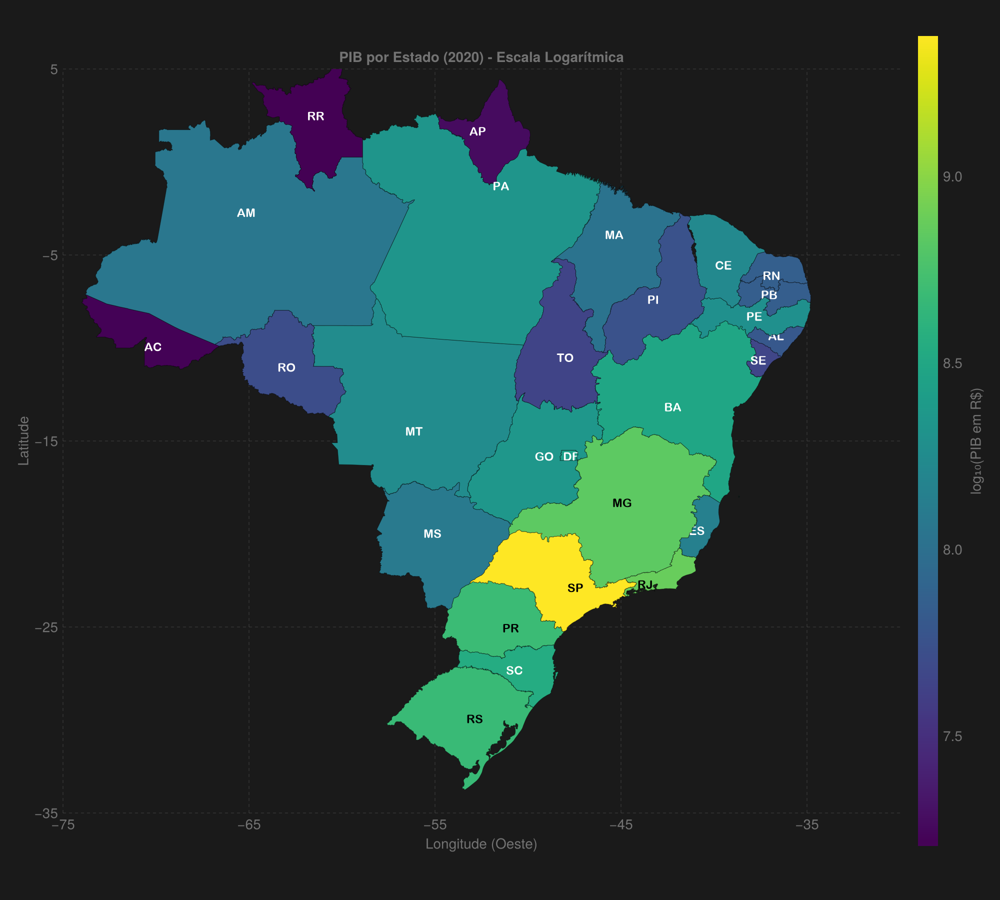

Bem-vindo à primeira parte da nossa série sobre trabalhos com mapas em Julia! Nesta série, exploraremos como criar visualizações geoespaciais poderosas e informativas usando a linguagem Julia. 

Neste primeiro post, vamos aprender como criar uma visualização do PIB (Produto Interno Bruto) por estado do Brasil. O resultado será um mapa temático que representa graficamente a distribuição do PIB entre as unidades federativas brasileiras, utilizando a biblioteca `CairoMakie` para visualização e `GeoArtifacts` para os dados geográficos.

## Introdução

A visualização de dados geográficos é uma ferramenta poderosa para entender padrões e tendências espaciais. No entanto, quem já procurou por tutoriais de visualização de mapas do Brasil em português provavelmente se deparou principalmente com exemplos em Python (usando bibliotecas como `geopandas` e `folium`) ou R (com pacotes como `ggplot2` e `sf`). A documentação em português para trabalhar com dados geoespaciais em Julia ainda é escassa, o que pode desencorajar muitos analistas de dados brasileiros a explorarem todo o potencial desta linguagem.

Este post vem preencher essa lacuna, demonstrando que é perfeitamente possível - e até mesmo vantajoso - trabalhar com visualizações de mapas do Brasil em Julia. Utilizaremos pacotes como `CairoMakie` para visualizações de alta qualidade, `GeoArtifacts` para dados geográficos do Brasil e `DataFrames` para manipulação de dados.

Os dados utilizados neste tutorial estão disponíveis no [repositório do projeto no GitHub](https://github.com/morrisonkuhlsen/map-pib-1), onde você pode encontrar o conjunto de dados completo e o código-fonte utilizado.

## Pré-requisitos

Antes de começar, certifique-se de ter os seguintes pacotes instalados. Abaixo está uma explicação do que cada um faz:

- **GeoArtifacts.jl**: Fornece acesso a conjuntos de dados geoespaciais, incluindo os limites territoriais do Brasil. Usaremos para obter os polígonos dos estados brasileiros.
- **GeoInterface.jl**: Define uma interface comum para trabalhar com dados geoespaciais de diferentes formatos, permitindo a interoperabilidade entre pacotes.
- **CairoMakie.jl**: Biblioteca de visualização de alto desempenho que usaremos para criar o mapa. Oferece gráficos de publicação de qualidade.
- **DataFrames.jl**: Estrutura de dados tabular essencial para manipulação e análise de dados em Julia.
- **CSV.jl**: Para leitura e escrita de arquivos CSV contendo os dados do PIB.
- **ColorSchemes.jl**: Fornece paletas de cores predefinidas e ferramentas para gerenciamento de esquemas de cores.
- **Colors.jl**: Oferece funcionalidades avançadas de manipulação de cores, incluindo conversão entre espaços de cores.
- **Statistics.jl**: Módulo padrão do Julia que fornece funções estatísticas básicas, como `mean()` que usaremos para calcular centros aproximados.

Para instalar todos os pacotes necessários, execute:

  

    
julia

    

    <button class="copy-button" onclick="copyCode(this)">
      <i class="bi bi-clipboard"></i>Copiar
    </button>
  

  

    <pre><code>using Pkg
Pkg.add(["GeoArtifacts", "GeoInterface", "CairoMakie", 
         "DataFrames", "CSV", "ColorSchemes", "Colors", "Statistics"])</code></pre>
  

## Passo a Passo

### 1. Carregando os Dados

Nesta seção, carregamos os dados do PIB de um arquivo CSV. O arquivo deve conter pelo menos três colunas:
- `uf`: Sigla do estado
- `ano`: Ano de referência
- `valor`: Valor do PIB em reais

O arquivo é lido usando o pacote `CSV.jl` e armazenado em um `DataFrame` para fácil manipulação.

### 2. Configuração Inicial

Aqui importamos todos os pacotes necessários e configuramos o tema visual do nosso gráfico. O `theme_dark()` do CairoMakie fornece um fundo escuro que ajuda a destacar as cores do mapa.

  

    
julia

    

    <button class="copy-button" onclick="copyCode(this)">
      <i class="bi bi-clipboard"></i>Copiar
    </button>
  

  

    <pre><code>using GeoArtifacts
using GeoInterface
using CairoMakie
using DataFrames
using CSV
using ColorSchemes
using Colors
using Statistics  # Importando para usar a função mean

set_theme!(theme_dark())</code></pre>
  

### 3. Funções Auxiliares

#### `text_color(c)`
Esta função determina se o texto deve ser preto ou branco com base no brilho da cor de fundo. Isso garante que o texto seja sempre legível, independentemente da cor do estado.

#### `approximate_center(geom)`
Calcula o centro aproximado de um polígono geográfico (estado) para posicionar sua sigla. A função:
1. Extrai as coordenadas do polígono
2. Converte para pontos 2D
3. Calcula a média das coordenadas para encontrar o centro

Criamos uma função para determinar a cor do texto com base no brilho do fundo, garantindo boa legibilidade:

  

    
julia

    

    <button class="copy-button" onclick="copyCode(this)">
      <i class="bi bi-clipboard"></i>Copiar
    </button>
  

  

    <pre><code># Função para determinar a cor do texto baseado no brilho da cor de fundo
function text_color(c)
    rgb = convert(RGB, c)
    luminance = 0.2126 * rgb.r + 0.7152 * rgb.g + 0.0722 * rgb.b
    return luminance > 0.6 ? RGB(0,0,0) : RGB(1,1,1)
end</code></pre>
  

### 4. Mapeamento de Estados

Criamos um dicionário que mapeia os nomes completos dos estados para suas siglas. Isso é necessário porque os dados geográficos usam nomes completos, enquanto nossos dados de PIB usam siglas.

Um dicionário para mapear nomes completos dos estados para suas siglas:

  

    
julia

    

    <button class="copy-button" onclick="copyCode(this)">
      <i class="bi bi-clipboard"></i>Copiar
    </button>
  

  

    <pre><code>const SIGLAS_UF = Dict(
    "Acre" => "AC",
    "Alagoas" => "AL",
    "Amapá" => "AP",
    "Amazonas" => "AM",
    "Bahia" => "BA",
    "Ceará" => "CE",
    "Distrito Federal" => "DF",
    "Espírito Santo" => "ES",
    "Goiás" => "GO",
    "Maranhão" => "MA",
    "Mato Grosso" => "MT",
    "Mato Grosso do Sul" => "MS",
    "Minas Gerais" => "MG",
    "Pará" => "PA",
    "Paraíba" => "PB",
    "Paraná" => "PR",
    "Pernambuco" => "PE",
    "Piauí" => "PI",
    "Rio de Janeiro" => "RJ",
    "Rio Grande do Norte" => "RN",
    "Rio Grande do Sul" => "RS",
    "Rondônia" => "RO",
    "Roraima" => "RR",
    "Santa Catarina" => "SC",
    "São Paulo" => "SP",
    "Sergipe" => "SE",
    "Tocantins" => "TO"
)</code></pre>
  

  

    
julia

    

    <button class="copy-button" onclick="copyCode(this)">
      <i class="bi bi-clipboard"></i>Copiar
    </button>
  

  

    <pre><code># Função alternativa para encontrar um ponto central aproximado
function approximate_center(geom)
    coords = GeoInterface.coordinates(geom)
    all_points = Vector{Point2f}()
    
    for poly in coords
        exterior = poly[1]
        points = Point2f.(first.(exterior), last.(exterior))
        append!(all_points, points)
    end
    
    # Calcular a média das coordenadas
    mean_x = mean([p[1] for p in all_points])
    mean_y = mean([p[2] for p in all_points])
    
    return Point2f(mean_x, mean_y)
end  
    </code></pre>
  

### 5. Processamento dos Dados

Nesta seção, processamos os dados brutos:
1. Filtramos apenas o ano de 2020
2. Criamos um dicionário que mapeia cada estado ao seu respectivo PIB
3. Aplicamos uma transformação logarítmica nos valores do PIB para melhor visualização (já que há grande variação entre os estados)
4. Normalizamos os valores para o intervalo [0,1] para o mapeamento de cores

  

    
julia

    

    <button class="copy-button" onclick="copyCode(this)">
      <i class="bi bi-clipboard"></i>Copiar
    </button>
  

  

    <pre><code># 1. Carregar os dados
df = CSV.read("tabela5938_uf.csv", DataFrame)

# Filtrar para o ano de 2020
df_2020 = filter(:ano => ==(2020), df)

# Dicionário PIB por estado (corrigido para reais)
pib_dict = Dict{String, Float64}()
for row in eachrow(df_2020)
    pib_dict[row.uf] = row.valor * 1_000  # Convertendo de mil R$ para R$
end</code></pre>
  

### 6. Carregando e Processando Dados Geográficos

1. Carregamos os dados geográficos dos estados brasileiros usando `GeoBR.state()`
2. Filtramos apenas os estados para os quais temos dados de PIB
3. Extraímos as geometrias, nomes e siglas dos estados
4. Aplicamos a transformação logarítmica nos valores do PIB e calculamos o mínimo e máximo para normalização

  

    
julia

    

    <button class="copy-button" onclick="copyCode(this)">
      <i class="bi bi-clipboard"></i>Copiar
    </button>
  

  

    <pre><code># 2. Carregar geometria dos estados
estados = GeoBR.state()

# Obter valores do PIB
pib_values = [get(pib_dict, estados.name_state[i], missing) for i in 1:length(estados.name_state)]

# Filtrar estados com valor disponível
has_value = .!ismissing.(pib_values)
geoms = [estados.geometry[i] for i in eachindex(estados.geometry) if has_value[i]]
pib_values = pib_values[has_value]
nomes_estados = estados.name_state[has_value]
siglas_uf = [SIGLAS_UF[name] for name in nomes_estados]

# 3. Transformação logarítmica
log_pib_values = log10.(pib_values)
pib_min, pib_max = extrema(log_pib_values)</code></pre>
  

### 7. Configuração das Cores

Usamos o esquema de cores `viridis` para o mapa, que é:
- Perceptualmente uniforme
- Acessível para daltônicos
- Funciona bem em preto e branco

Mapeamos os valores do PIB (em escala logarítmica) para cores no esquema `viridis`, onde tons mais claros representam valores mais altos.

  

    
julia

    

    <button class="copy-button" onclick="copyCode(this)">
      <i class="bi bi-clipboard"></i>Copiar
    </button>
  

  

    <pre><code># 4. Configuração de cores
colors = [get(ColorSchemes.viridis, (x - pib_min) / (pib_max - pib_min)) for x in log_pib_values]
</code></pre>
  

### 8. Criando a Visualização

Esta é a parte principal onde criamos o mapa:

1. **Configuração da Figura**:
   - Criamos uma figura com tamanho 1000x900 pixels
   - Definimos os limites geográficos para cobrir todo o território brasileiro
   - Configuramos os eixos com grades e ticks apropriados

2. **Desenho dos Estados**:
   - Para cada estado, extraímos suas coordenadas
   - Desenhamos o polígono com a cor correspondente ao seu PIB
   - Adicionamos uma borda preta sutil para melhorar a distinção

3. **Adição das Siglas**:
   - Calculamos a posição central de cada estado
   - Determinamos a cor do texto (preto ou branco) com base no brilho da cor de fundo
   - Adicionamos a sigla do estado no centro do polígono

4. **Barra de Cores**:
   - Adicionamos uma barra lateral que mostra a escala de cores
   - A escala está em log10(PIB) para melhor visualização

5. **Top 10 Estados**:
   - Ordenamos os estados por PIB
   - Exibimos os 10 maiores PIBs no console

6. **Exibição**:
   - Finalmente, exibimos a figura resultante

  

    
julia

    

    <button class="copy-button" onclick="copyCode(this)">
      <i class="bi bi-clipboard"></i>Copiar
    </button>
  

  

    <pre><code># 5. Configuração do mapa
fig = Figure(size = (1000, 900))

# Limites geográficos do Brasil
lon_min, lon_max = -75.0, -30.0
lat_min, lat_max = -35.0, 5.0

ax = Axis(fig[1, 1],
    title = "PIB por Estado (2020) - Escala Logarítmica",
    xlabel = "Longitude (Oeste)",
    ylabel = "Latitude",
    aspect = DataAspect(),
    limits = (lon_min, lon_max, lat_min, lat_max)
)

# Configuração das grades
ax.xgridvisible = true
ax.ygridvisible = true
ax.xgridcolor = (:gray, 0.2)
ax.ygridcolor = (:gray, 0.2)
ax.xgridstyle = :dash
ax.ygridstyle = :dash

# Configuração dos ticks
ax.xticks = -75:10:-30
ax.yticks = -35:10:5

# 6. Plotagem dos estados e siglas
for (i, geom) in enumerate(geoms)
    coords = GeoInterface.coordinates(geom)
    for poly in coords
        exterior = poly[1]
        pontos = Point2f.(first.(exterior), last.(exterior))
        poly!(ax, pontos, color = colors[i], strokecolor = (:black, 0.5), strokewidth = 0.5)
    end
    
    # Calcular posição aproximada para a sigla
    center = approximate_center(geom)
    
    # Determinar cor do texto baseado na cor do estado
    txt_color = text_color(colors[i])
    
    # Adicionar texto da sigla
    text!(ax, siglas_uf[i], 
        position = center,
        color = txt_color,
        align = (:center, :center),
        fontsize = 12,
        font = "Arial Bold")
end

# 7. Barra de cores
Colorbar(fig[1, 2],
    limits = (pib_min, pib_max),
    colormap = :viridis,
    label = raw"log₁₀(PIB em R$)",
    width = 20,
    ticks = LinearTicks(5)
)

# 8. Exibição dos top estados
df_top = sort(df_2020, :valor, rev=true)
println("\nTop 10 maiores PIBs estaduais em 2020:")

for (i, row) in enumerate(eachrow(df_top[1:10, :]))
    valor_real = row.valor * 1_000  # Convertendo de mil R$ para R$
    if valor_real >= 1e12
        println("$i. $(row.uf): R\$ $(round(valor_real / 1e12, digits=2)) trilhões")
    else
        println("$i. $(row.uf): R\$ $(round(valor_real / 1e9, digits=2)) bilhões")
    end
end

fig</code></pre>
  

Aqui está o resultado da visualização:

<figure style="display: flex; flex-direction: column; align-items: center; margin: 2.5em 0 2em 0;">
  
  <figcaption class="img-caption-contrast">
    <strong>Figura 1:</strong> Mapa do Brasil mostrando a distribuição do PIB por estado em 2020. As cores representam os valores em escala logarítmica, com tons mais claros (amarelos) indicando valores mais altos de PIB e tons mais escuros (roxos) indicando valores mais baixos.
  </figcaption>
</figure>

## Considerações Finais

Este exemplo demonstra como criar uma visualização geográfica interativa do PIB brasileiro por estado usando Julia. Alguns pontos importantes:

1. **Escala Logarítmica**: Usamos uma escala logarítmica para melhor visualização da distribuição do PIB, que varia muito entre os estados. A transformação aplicada foi:

   $$
   \text{log_pib} = \log_{10}(\text{PIB})
   $$
   
   Onde:
   - $\text{PIB}$ é o valor original em reais
   - $\log_{10}$ é o logaritmo na base 10
   - $\text{log\_pib}$ é o valor transformado usado no mapeamento de cores

2. **Cores**: O esquema de cores `viridis` foi escolhido por ser perceptualmente uniforme e acessível para daltônicos.

3. **Interatividade**: A visualização pode ser facilmente estendida para incluir tooltips e interatividade com pacotes como `Makie`.

4. **Dados Atualizados**: Certifique-se de usar os dados mais recentes do IBGE para análises reais.

## O Módulo GeoBR

O pacote `GeoArtifacts.jl` inclui o submódulo `GeoBR`, que fornece acesso a uma variedade de dados geoespaciais do Brasil. Aqui estão as principais funções disponíveis:

### Dados Territoriais
- `GeoBR.state` - Dados dos estados brasileiros
- `GeoBR.municipality` - Dados dos municípios
- `GeoBR.region` - Dados das regiões do Brasil
- `GeoBR.country` - Dados do território nacional
- `GeoBR.amazon` - Dados da Amazônia Legal
- `GeoBR.biomes` - Biomas brasileiros
- `GeoBR.urbanarea` - Áreas urbanas
- `GeoBR.metropolitan_area` - Regiões metropolitanas
- `GeoBR.indigenousland` - Terras indígenas
- `GeoBR.conservationunits` - Unidades de conservação

### Divisões Administrativas
- `GeoBR.mesoregion` - Mesorregiões
- `GeoBR.microregion` - Microrregiões
- `GeoBR.intermediateregion` - Regiões intermediárias
- `GeoBR.immediateregion` - Regiões imediatas
- `GeoBR.municipalseat` - Sedes municipais
- `GeoBR.censustract` - Setores censitários
- `GeoBR.weightingarea` - Áreas de ponderação

### Dados Específicos
- `GeoBR.healthfacilities` - Instalações de saúde
- `GeoBR.schools` - Escolas
- `GeoBR.disasterriskarea` - Áreas de risco de desastres
- `GeoBR.semiarid` - Região do semiárido
- `GeoBR.comparableareas` - Áreas comparáveis
- `GeoBR.urbanconcentrations` - Concentrações urbanas
- `GeoBR.poparrangements` - Arranjos populacionais
- `GeoBR.healthregion` - Regiões de saúde

Cada função permite acessar dados geoespaciais oficiais do Brasil, que podem ser facilmente integrados em análises e visualizações como a que desenvolvemos neste tutorial.

## Referências

1. **Dados do PIB**
   - [SIDRA/IBGE - Tabela 5938](https://sidra.ibge.gov.br/tabela/5938) - Dados do PIB dos municípios brasileiros

2. **Pacotes e Ferramentas**
   - [GeoArtifacts.jl](https://github.com/JuliaEarth/GeoArtifacts.jl) - Pacote para gerenciamento de dados geoespaciais em Julia
   - [CairoMakie.jl](https://docs.makie.org/stable/) - Biblioteca de visualização de alta performance
   - [GeoBR](https://ipeagit.github.io/geobr/) - Pacote R que inspirou algumas funcionalidades (equivalente em R)
   - [Repositório do Código Fonte](https://github.com/morrisonkuhlsen/map-pib-1) - Código completo e base de dados utilizados neste tutorial

3. **Tutoriais Relacionados**
   - [Trabalhando com dados geoespaciais no R](https://blog.curso-r.com/posts/2019-02-10-sf-miojo/)
   - [Acessando dados do SIDRA com R](https://cran.r-project.org/web/packages/sidrar/vignettes/Introduction_to_sidrar.html)

4. **Discussões da Comunidade**
   - [Dados de estados brasileiros em Julia](https://discourse.julialang.org/t/data-from-brazil-states-and-generic-region-using-vegadatasets/127761/2)
   - [Anúncio do GeoArtifacts.jl](https://discourse.julialang.org/t/ann-geoartifacts-jl-artifacts-for-geospatial-data-science-in-julia/114508)
