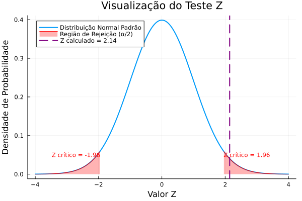
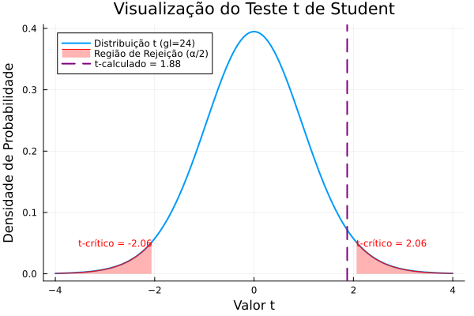

Uma das dúvidas mais comuns em inferência estatística é decidir entre o **Teste Z** e o **Teste t de Student** ao realizar um teste de hipóteses para a média de uma população. Embora ambos os testes sejam semelhantes, a escolha correta depende de uma condição fundamental: **o conhecimento sobre o desvio padrão da população**.

Este guia prático irá detalhar as diferenças, mostrar quando usar cada um e guiar você através de um exemplo completo, resolvido à mão e com código em Julia.

---

## Uma Breve História: De Gauss a Gosset

Para entender a diferença entre os testes, é útil conhecer suas origens.

O **Teste Z** é o mais antigo dos dois, fundamentado na **distribuição normal**, também conhecida como curva de Gauss. A teoria por trás dela foi desenvolvida por matemáticos como Abraham de Moivre, Pierre-Simon Laplace e Carl Friedrich Gauss nos séculos XVIII e XIX. O Teste Z tornou-se uma ferramenta padrão para a estatística porque, sob certas condições (como o Teorema Central do Limite), muitas médias amostrais se comportam de acordo com essa distribuição. Sua principal premissa, no entanto, sempre foi uma grande limitação: ele exige que conheçamos o verdadeiro desvio padrão da população ($\sigma$), um parâmetro que raramente está disponível no mundo real.

A solução para esse problema surgiu no início do século XX, em um lugar inesperado: a Cervejaria Guinness, em Dublin. **William Sealy Gosset**, um químico e estatístico que trabalhava para a Guinness, enfrentava um desafio prático: como testar a qualidade de lotes de cevada usando apenas amostras pequenas? O Teste Z não era adequado, pois o desvio padrão da população era desconhecido.

Gosset dedicou-se a resolver essa questão e, em 1908, publicou sua descoberta sob o pseudônimo de **"Student"** (a Guinness não permitia que seus funcionários publicassem pesquisas em seus próprios nomes para proteger segredos comerciais). Ele desenvolveu uma nova distribuição, a **distribuição t de Student**, que se ajusta à incerteza de estimar o desvio padrão a partir de uma amostra pequena. Assim nasceu o **Teste t**, uma das ferramentas mais importantes e amplamente utilizadas na estatística moderna, permitindo que pesquisadores tirem conclusões robustas mesmo com dados limitados.

---

## A Diferença Fundamental: $\sigma$ Conhecido vs. Desconhecido

A regra de ouro para escolher entre os testes é simples:

1.  **Use o Teste Z quando:**
    *   O desvio padrão da população ($\sigma$) **é conhecido**.
    *   **OU** o tamanho da amostra ($n$) é grande (geralmente $n > 30$), e o desvio padrão da população é desconhecido. Pelo Teorema Central do Limite, a distribuição das médias amostrais se aproxima da normal, e o desvio padrão da amostra ($s$) se torna uma estimativa confiável de $\sigma$.

2.  **Use o Teste t de Student quando:**
    *   O desvio padrão da população ($\sigma$) **é desconhecido**.
    *   O tamanho da amostra ($n$) é pequeno (geralmente $n \le 30$).

A distribuição t de Student é mais "achatada" e com caudas mais pesadas que a distribuição normal padrão (Z), o que reflete a incerteza adicional de ter que estimar o desvio padrão da população a partir da amostra.

<figure style="display: flex; flex-direction: column; align-items: center; margin: 2.5em 0 2em 0;">
  
  <figcaption class="img-caption-contrast">
    <strong>Figura:</strong> Fluxograma para decidir entre o Teste Z e o Teste t de Student.
  </figcaption>
</figure>

---

## Exemplo Prático: Altura Média de Estudantes

Uma pesquisadora de uma universidade quer verificar se a altura média dos estudantes do primeiro ano é diferente da média nacional, que é de **175 cm**. Ela coleta uma amostra aleatória de **25 estudantes** e obtém os seguintes resultados:
- **Média da amostra ($\bar{x}$):** 178 cm
- **Desvio padrão da amostra ($s$):** 8 cm

Ela decide usar um nível de significância de **$\alpha = 0.05$**.

### Cenário 1: Teste Z (Desvio Padrão da População Conhecido)

Vamos supor um cenário hipotético onde um estudo nacional anterior determinou que o desvio padrão da altura de todos os estudantes universitários do país é **$\sigma = 7$ cm**.

#### 1. Definir as Hipóteses
- **Hipótese Nula ($H_0$):** A altura média dos estudantes é igual à média nacional.
  $$H_0: \mu = 175 \text{ cm}$$
- **Hipótese Alternativa ($H_1$):** A altura média é diferente da média nacional (teste bilateral).
  $$H_1: \mu \neq 175 \text{ cm}$$

#### 2. Calcular a Estatística de Teste Z

$$
Z = \frac{\bar{x} - \mu_0}{\sigma / \sqrt{n}} = \frac{178 - 175}{7 / \sqrt{25}} = \frac{3}{7 / 5} = \frac{3}{1.4} \approx 2.14
$$

#### 3. Determinar o Valor Crítico e o P-valor
- **Valor Crítico:** Para um teste bilateral com $\alpha = 0.05$, olhamos a área de $\alpha/2 = 0.025$ em cada cauda. O valor Z crítico correspondente é **$\pm 1.96$**.
- **P-valor:** É a probabilidade de observar um valor Z tão extremo ou mais extremo que 2.14.
  $P(Z > 2.14) \approx 0.0162$. Como o teste é bilateral, multiplicamos por 2:
  **p-valor** = $2 \times 0.0162 = 0.0324$.

#### 4. Tomar a Decisão
- **Comparando a estatística de teste:** Nosso Z calculado (2.14) é maior que o Z crítico (1.96). Ele cai na região de rejeição.
- **Comparando o p-valor:** Nosso p-valor (0.0324) é menor que o nível de significância $\alpha$ (0.05).

Ambas as abordagens levam à mesma conclusão: **rejeitamos a hipótese nula ($H_0$)**.

#### 5. Intervalo de Confiança (95%)

$$
IC = \bar{x} \pm Z_{\alpha/2} \cdot \frac{\sigma}{\sqrt{n}} = 178 \pm 1.96 \cdot \frac{7}{\sqrt{25}} = 178 \pm 1.96 \cdot 1.4 = 178 \pm 2.744
$$

**IC = [175.26, 180.74]**

Como o valor da hipótese nula (175) não está dentro do intervalo de confiança, isso reforça nossa decisão de rejeitar $H_0$.

#### 6. Resolução em Julia (Teste Z)

  

    
julia

    

    <button class="copy-button" onclick="copyCode(this)">
      <i class="bi bi-clipboard"></i>Copiar
    </button>
  

  

    <pre><code>using HypothesisTests, Distributions

# Parâmetros do problema
μ₀ = 175      # Média sob H₀
x̄ = 178       # Média da amostra
σ = 7         # Desvio padrão populacional CONHECIDO
n = 25        # Tamanho da amostra

# Realizando o Teste Z para uma amostra
ztest = OneSampleZTest(x̄, σ, n, μ₀)
p_valor = pvalue(ztest)
z_stat = ztest.z
ci = confint(ztest)

println("--- Resultados do Teste Z ---")
println("Estatística Z calculada: ", round(z_stat, digits=3))
println("P-valor: ", round(p_valor, digits=3))
println("Intervalo de Confiança (95%): [", round(ci[1], digits=2), ", ", round(ci[2], digits=2), "]")
</code></pre>
  

  
# Saída

  
--- Resultados do Teste Z ---

  
Estatística Z calculada: 2.143

  
P-valor: 0.032

  
Intervalo de Confiança (95%): [175.26, 180.74]

#### Gráfico Gerado:
<figure style="display: flex; flex-direction: column; align-items: center; margin: 2.5em 0 2em 0;">
  
  <figcaption class="img-caption-contrast">
    <strong>Figura:</strong> O gráfico mostra que a estatística Z calculada (linha roxa) está dentro da região de rejeição (área vermelha), confirmando a decisão de rejeitar a hipótese nula.
  </figcaption>
</figure>

---

### Cenário 2: Teste t de Student (Desvio Padrão da População Desconhecido)

Agora, vamos ao cenário mais realista: a pesquisadora **não conhece** o desvio padrão da população ($\sigma$) e deve usar o desvio padrão da sua amostra, **$s = 8$ cm**.

#### 1. Definir as Hipóteses
As hipóteses são as mesmas:
$$H_0: \mu = 175 \text{ cm}$$
$$H_1: \mu \neq 175 \text{ cm}$$

#### 2. Calcular a Estatística de Teste t

Os graus de liberdade são $gl = n - 1 = 25 - 1 = 24$.

$$
t = \frac{\bar{x} - \mu_0}{s / \sqrt{n}} = \frac{178 - 175}{8 / \sqrt{25}} = \frac{3}{8 / 5} = \frac{3}{1.6} = 1.875
$$

#### 3. Determinar o Valor Crítico e o P-valor
- **Valor Crítico:** Para um teste bilateral com $\alpha = 0.05$ e 24 graus de liberdade, consultamos a tabela t de Student. O valor t crítico é **$\pm 2.064$**.
- **P-valor:** É a probabilidade de observar um valor t tão extremo ou mais extremo que 1.875. Usando software, encontramos **p-valor $\approx 0.072$**.

#### 4. Tomar a Decisão
- **Comparando a estatística de teste:** Nosso t calculado (1.875) é menor que o t crítico (2.064). Ele **não** cai na região de rejeição.
- **Comparando o p-valor:** Nosso p-valor (0.072) é maior que o nível de significância $\alpha$ (0.05).

Ambas as abordagens levam à mesma conclusão: **falhamos em rejeitar a hipótese nula ($H_0$)**.

#### 5. Intervalo de Confiança (95%)

$$
IC = \bar{x} \pm t_{\alpha/2, gl} \cdot \frac{s}{\sqrt{n}} = 178 \pm 2.064 \cdot \frac{8}{\sqrt{25}} = 178 \pm 2.064 \cdot 1.6 = 178 \pm 3.3024
$$

**IC = [174.70, 181.30]**

O valor da hipótese nula (175) está dentro do intervalo de confiança, o que confirma nossa decisão de não rejeitar $H_0$.

> **Conclusão do Exemplo:** Note como a incerteza adicional (usar $s$ em vez de $\sigma$) levou a uma conclusão diferente. O Teste t é mais conservador, exigindo uma evidência mais forte para rejeitar a hipótese nula.

---

### Resolução em Julia (Teste t)

Vamos resolver o cenário realista (Teste t) usando Julia, incluindo um gráfico para visualização.

  

    
julia

    

    <button class="copy-button" onclick="copyCode(this)">
      <i class="bi bi-clipboard"></i>Copiar
    </button>
  

  

    <pre><code>using HypothesisTests, Distributions, Plots

# Parâmetros do problema
μ₀ = 175      # Média sob H₀
x̄ = 178       # Média da amostra
s = 8         # Desvio padrão da amostra
n = 25        # Tamanho da amostra
α = 0.05      # Nível de significância

# Realizando o Teste t de Student para uma amostra
# Nota: A função OneSampleTTest espera os dados, mas podemos passar as estatísticas
# criando um objeto T-Test manualmente para obter os resultados.
ttest = OneSampleTTest(x̄, s, n, μ₀)
p_valor = pvalue(ttest)
t_stat = ttest.t
gl = n - 1
ci = confint(ttest)

println("--- Resultados do Teste t de Student ---")
println("Estatística t calculada: ", round(t_stat, digits=3))
println("Graus de Liberdade: ", gl)
println("P-valor: ", round(p_valor, digits=3))
println("Intervalo de Confiança (95%): [", round(ci[1], digits=2), ", ", round(ci[2], digits=2), "]")

# Visualização Gráfica
dist = TDist(gl)
t_critico = quantile(dist, 1 - α/2)

plot(x -> pdf(dist, x), -4, 4, label="Distribuição t (gl=$gl)", 
     xlabel="Valor t", ylabel="Densidade de Probabilidade",
     title="Visualização do Teste t de Student",
     linewidth=2, legend=:topleft)

# Área de rejeição (cauda direita)
plot!(x -> pdf(dist, x), t_critico, 4, fill=(0, 0.3, :red), 
      label="Região de Rejeição (α/2)", color=:red)

# Área de rejeição (cauda esquerda)
plot!(x -> pdf(dist, x), -4, -t_critico, fill=(0, 0.3, :red), 
      label="", color=:red)

# Linha da estatística de teste
vline!([t_stat], color=:purple, linestyle=:dash, linewidth=2, 
       label="t-calculado = $(round(t_stat, digits=2))")

annotate!(-t_critico, 0.05, text("t-crítico = -$(round(t_critico, digits=2))", :red, :right, 8))
annotate!(t_critico, 0.05, text("t-crítico = $(round(t_critico, digits=2))", :red, :left, 8))
</code></pre>
  

#### Saída esperada:

  
# Saída

  
--- Resultados do Teste t de Student ---

  
Estatística t calculada: 1.875

  
Graus de Liberdade: 24

  
P-valor: 0.072

  
Intervalo de Confiança (95%): [174.7, 181.3]

#### Gráfico Gerado:
<figure style="display: flex; flex-direction: column; align-items: center; margin: 2.5em 0 2em 0;">
  
  <figcaption class="img-caption-contrast">
    <strong>Figura:</strong> O gráfico mostra que a estatística t calculada (linha roxa) está fora das regiões de rejeição (áreas vermelhas), confirmando que não podemos rejeitar a hipótese nula.
  </figcaption>
</figure>

---

## Apêndice: O Que Fazer com Valores Z Extremos?

Às vezes, ao calcular a estatística de teste, você pode obter um valor Z que está muito fora do intervalo das tabelas padrão (que geralmente vão de -3.99 a +3.99). O que isso significa?

Vamos usar o exemplo de um **Z-calculado = -6.36**.

👉 **Por que não está na tabela?**

A tabela Z mostra a probabilidade acumulada até um certo valor. Um valor de Z = -6.36 significa que a observação está **6.36 desvios padrão abaixo da média** — uma região de probabilidade extremamente baixa e rara.

#### Cálculo da Probabilidade (P-valor)

Para um valor tão extremo, o p-valor (a área na cauda) será praticamente zero. Usando software ou uma aproximação analítica, encontramos:

$$
P(Z < -6.36) \approx 1.0 \times 10^{-10}
$$

Isso é `0.0000000001`.

💡 **Interpretação Prática:**
Em um teste de hipóteses, um p-valor tão pequeno é uma evidência extremamente forte contra a hipótese nula. Para todos os fins práticos, podemos considerar o p-valor como sendo zero.

#### Cálculo Manual (Aproximação da Cauda)

É possível estimar essa probabilidade manualmente. O objetivo é calcular a área acumulada até -6.36, que é representada pela integral da função de densidade da normal padrão:

$$
P(Z < -6.36) = \int_{-\infty}^{-6.36} \frac{1}{\sqrt{2\pi}} e^{-z^2/2} dz
$$

Não é possível resolver essa integral exatamente à mão, mas há aproximações precisas para valores extremos.

**Passo 1 – Fórmula de Aproximação**

Para um valor $z$ muito negativo ($z < -3$), a probabilidade acumulada $P(Z < z)$ pode ser aproximada por:

$$
P(Z < z) \approx \frac{1}{\sqrt{2\pi}} \frac{e^{-z^2/2}}{|z|}
$$

**Passo 2 – Substituindo $z = -6.36$**

1.  **Calcule $z^2$:**
    $(-6.36)^2 = 40.4496$

2.  **Calcule $e^{-z^2/2}$:**
    $e^{-40.4496 / 2} = e^{-20.2248} \approx 1.64 \times 10^{-9}$

3.  **Substitua na fórmula:**

    $$
    P(Z < -6.36) \approx \frac{1}{\sqrt{2\pi}} \cdot \frac{1.64 \times 10^{-9}}{|-6.36|}
    $$

    Sabendo que $\frac{1}{\sqrt{2\pi}} \approx 0.39894$:

    $$
    P(Z < -6.36) \approx 0.39894 \cdot \frac{1.64 \times 10^{-9}}{6.36}
    $$
    
    $$
    P(Z < -6.36) \approx 0.39894 \cdot (2.58 \times 10^{-10}) \approx 1.03 \times 10^{-10}
    $$

**Resultado final:**

$$
P(Z < -6.36) \approx 0.0000000001
$$

ou seja,

$$
\Phi(-6.36) \approx 1.0 \times 10^{-10}
$$

Isso confirma que a chance de observar um resultado tão extremo é menor que uma em 10 bilhões, reforçando a decisão de rejeitar a hipótese nula com altíssima confiança.

---

## Resumo Final

  <table class="table table-bordered table-striped" style="width: 100%; border-collapse: collapse;">
    <thead class="table-light">
      <tr>
        <th style="padding: 12px; border: 1px solid #dee2e6; text-align: left;">Característica</th>
        <th style="padding: 12px; border: 1px solid #dee2e6; text-align: left;">Teste Z</th>
        <th style="padding: 12px; border: 1px solid #dee2e6; text-align: left;">Teste t de Student</th>
      </tr>
    </thead>
    <tbody>
      <tr>
        <td style="padding: 12px; border: 1px solid #dee2e6;"><strong>Condição Principal</strong></td>
        <td style="padding: 12px; border: 1px solid #dee2e6;">$\sigma$ (desvio padrão populacional) é <strong>conhecido</strong></td>
        <td style="padding: 12px; border: 1px solid #dee2e6;">$\sigma$ é <strong>desconhecido</strong></td>
      </tr>
      <tr>
        <td style="padding: 12px; border: 1px solid #dee2e6;"><strong>Uso Secundário</strong></td>
        <td style="padding: 12px; border: 1px solid #dee2e6;">Amostra grande ($n > 30$)</td>
        <td style="padding: 12px; border: 1px solid #dee2e6;">Amostra pequena ($n \le 30$)</td>
      </tr>
      <tr>
        <td style="padding: 12px; border: 1px solid #dee2e6;"><strong>Distribuição de Referência</strong></td>
        <td style="padding: 12px; border: 1px solid #dee2e6;">Normal Padrão (Z)</td>
        <td style="padding: 12px; border: 1px solid #dee2e6;">t de Student (com $n-1$ graus de liberdade)</td>
      </tr>
      <tr>
        <td style="padding: 12px; border: 1px solid #dee2e6;"><strong>Fórmula da Estatística</strong></td>
        <td style="padding: 12px; border: 1px solid #dee2e6;">$$Z = \frac{\bar{x} - \mu_0}{\sigma / \sqrt{n}}$$</td>
        <td style="padding: 12px; border: 1px solid #dee2e6;">$$t = \frac{\bar{x} - \mu_0}{s / \sqrt{n}}$$</td>
      </tr>
      <tr>
        <td style="padding: 12px; border: 1px solid #dee2e6;"><strong>Conservadorismo</strong></td>
        <td style="padding: 12px; border: 1px solid #dee2e6;">Menos conservador</td>
        <td style="padding: 12px; border: 1px solid #dee2e6;">Mais conservador (exige evidência mais forte)</td>
      </tr>
    </tbody>
  </table>

  ---

## 🎧 Podcast: Aprofundando em Teste Z vs Test t de Student

Para uma discussão mais aprofundada sobre o tema, ouça o nosso podcast. Cobrimos exemplos práticos e dicas para escolher a distribuição correta para seus dados.

<iframe width="100%" height="166" scrolling="no" frameborder="no" allow="autoplay" src="https://w.soundcloud.com/player/?url=https%3A//api.soundcloud.com/tracks/soundcloud%253Atracks%253A2193736583&color=%23ff5500&auto_play=false&hide_related=false&show_comments=true&show_user=true&show_reposts=false&show_teaser=true"></iframe>
<a href="https://soundcloud.com/morrison-kuehlsen" title="Morrison Kühlsen" target="_blank" style="color: #cccccc; text-decoration: none;">Morrison Kühlsen</a> · <a href="https://soundcloud.com/morrison-kuehlsen/teste-z-vs-teste-t-de-student-qual-escolher" title="Teste Z vs Teste t de Student, qual escolher?" target="_blank" style="color: #cccccc; text-decoration: none;">Teste Z vs Teste t de Student, qual escolher?</a>

---

## Referências

*   Student. (1908). The probable error of a mean. *Biometrika*, 6(1), 1–25.
*   Wikipedia contributors. (2025). *Z-test*. Wikipedia, The Free Encyclopedia. [https://en.wikipedia.org/wiki/Z-test](https://en.wikipedia.org/wiki/Z-test)
*   Wikipedia contributors. (2025). *Student's t-test*. Wikipedia, The Free Encyclopedia. [https://en.wikipedia.org/wiki/Student%27s_t-test](https://en.wikipedia.org/wiki/Student%27s_t-test)
*   Montgomery, D. C., & Runger, G. C. (2018). *Applied Statistics and Probability for Engineers*. John Wiley & Sons.
