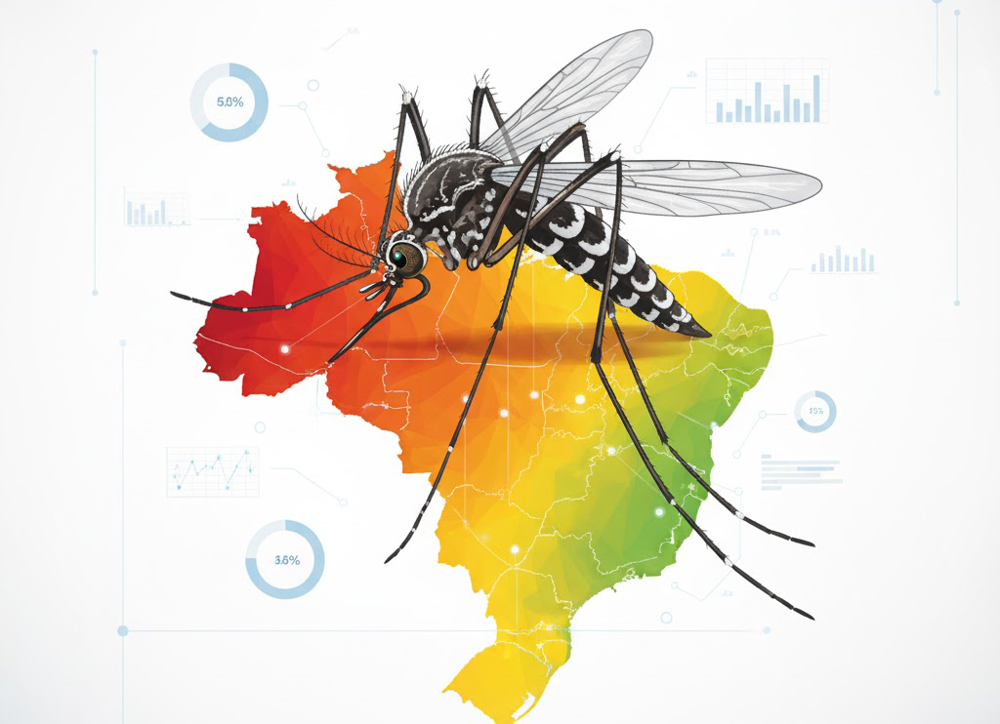
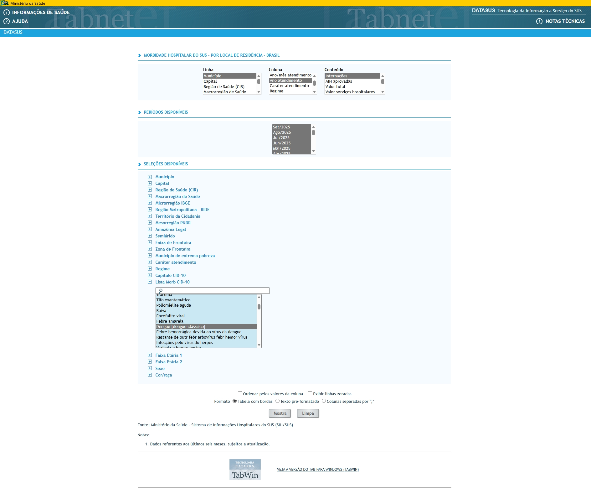
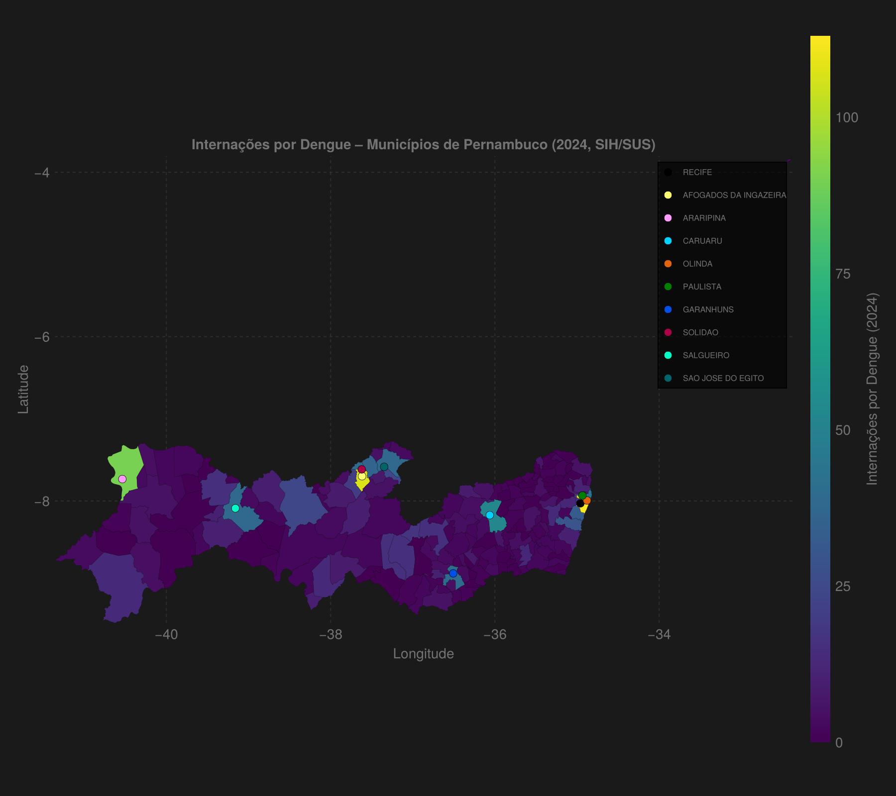

No nosso [post anterior](/pt/visualizacao-de-dados/visualizacao-pib-brasil-julia), criamos um mapa do PIB por estado. Agora, vamos aprofundar nossa análise geoespacial para um nível mais granular e impactante: a saúde pública municipal.

Neste tutorial, vamos mapear a **incidência de internações por dengue nos municípios de Pernambuco**, utilizando dados públicos do SIH/SUS (Sistema de Informações Hospitalares do SUS). Este projeto não apenas demonstra o poder de Julia para visualização, mas também aborda um desafio comum na ciência de dados: lidar com dados governamentais que raramente vêm em formatos limpos e padronizados.

Vamos transformar um arquivo CSV semi-estruturado em um mapa temático informativo e visualmente atraente.

## Origem dos Dados: Navegando no TabNet do DATASUS

Os dados utilizados neste projeto são públicos e foram extraídos do **TabNet**, o tabulador oficial do Departamento de Informática do SUS (DATASUS). Especificamente, utilizamos os registros de **Morbidade Hospitalar do SUS (SIH/SUS)**, filtrados por local de residência.

O TabNet é uma ferramenta poderosa, porém sua interface pode ser pouco intuitiva. Ela permite cruzar informações de diversas bases de dados de saúde, como internações, procedimentos, e estatísticas vitais. Para este projeto, selecionamos "Internações" como a linha, "Município" como a coluna, e os anos de interesse no período, gerando um arquivo CSV que serve de base para nossa análise.

<figure style="display: flex; flex-direction: column; align-items: center; margin: 2.5em 0 2em 0;">
  
  <figcaption class="img-caption-contrast">
    <strong>Figura 1:</strong> Interface do TabNet do DATASUS, de onde os dados de internações foram extraídos. A plataforma permite customizar a extração por região, período e variáveis de interesse.
  </figcaption>
</figure>

Você pode explorar e extrair dados semelhantes diretamente da fonte:
- **Fonte dos Dados:** [SIH/SUS - Morbidade Hospitalar por Local de Residência](http://tabnet.datasus.gov.br/cgi/deftohtm.exe?sih/cnv/nrbr.def)

## O Desafio: Dados Públicos do Mundo Real

Diferente de conjuntos de dados curados, os arquivos do DATASUS, como o que usaremos, apresentam vários desafios:
- **Cabeçalho Dinâmico:** A linha que contém os nomes das colunas (os anos) não é a primeira do arquivo.
- **Formato Misto:** A primeira coluna mistura o código IBGE com o nome do município.
- **Delimitadores e Ausência de Dados:** O arquivo usa ponto e vírgula (`;`) e representa dados ausentes com `"-"` ou `"."`.

Nosso código é projetado para superar esses obstáculos de forma robusta.

## Pré-requisitos

Certifique-se de ter os pacotes Julia necessários instalados. Eles são a nossa caixa de ferramentas para manipulação de dados, geoprocessamento e visualização.

- **CSV.jl & DataFrames.jl**: Para ler e manipular os dados tabulares.
- **GeoArtifacts.jl & GeoInterface.jl**: Para obter as malhas geográficas dos municípios.
- **CairoMakie.jl**: Nossa biblioteca principal para criar o mapa.
- **ColorSchemes.jl & Colors.jl**: Para gerenciar a paleta de cores do mapa.
- **Unicode.jl**: Essencial para normalizar nomes de municípios, removendo acentos e caracteres especiais para garantir a junção correta dos dados.

  

    
julia

    

    <button class="copy-button" onclick="copyCode(this)">
      <i class="bi bi-clipboard"></i>Copiar
    </button>
  

  

    <pre><code>using Pkg
Pkg.add(["CSV", "DataFrames", "GeoArtifacts", "GeoInterface", 
         "CairoMakie", "ColorSchemes", "Colors", "Statistics", "Unicode"])</code></pre>
  

## Passo a Passo do Código

### 1. Configuração e Funções Auxiliares

Primeiro, definimos constantes globais para o estado e ano de interesse. Em seguida, criamos funções auxiliares que são o coração da nossa etapa de limpeza de dados.

- `norm_key(s)`: A função mais crítica. Ela recebe um nome de município, converte para minúsculas, remove acentos e caracteres especiais. Isso cria uma "chave de junção" padronizada (ex: "Água Preta" vira "aguapreta"), permitindo que os dados do CSV correspondam aos dados da malha geográfica, mesmo que a grafia não seja idêntica.
- `extrair_uf_codigo(s)` e `limpar_nome_muni(s)`: Funções que usam expressões regulares para extrair o código IBGE e limpar o nome do município da primeira coluna do CSV.

  

    
julia

    

    <button class="copy-button" onclick="copyCode(this)">
      <i class="bi bi-clipboard"></i>Copiar
    </button>
  

  

    <pre><code>using CSV, DataFrames, GeoArtifacts, GeoInterface, CairoMakie, ColorSchemes, Colors, Statistics, Unicode

set_theme!(theme_dark())

# Parâmetros
const UF_ALVO  = "PE"
const NOME_UF  = "Pernambuco"
const ARQ_MUN  = "sih_cnv_nibr111825170_150_81_250.csv" # Seu arquivo de dados
const ANO      = 2024

# Função para normalizar chaves de município
function norm_key(s)
    s = Unicode.normalize(s, strip=true) # Remove acentos
    return lowercase(strip(s)) # Converte para minúsculas e remove espaços
end

# Extrai código da UF e nome do município
function extrair_uf_codigo(s)
    m = match(r"^(\d{2})\s+(.+)$", s)
    return m !== nothing ? (parse(Int, m.captures[1]), strip(m.captures[2])) : (missing, missing)
end

# Limpa nome do município
function limpar_nome_muni(s)
    s = Unicode.normalize(s, strip=true)
    return uppercasefirst.(split(strip(s), r"\s+")) |> x -> join(x, " ")
end
</code></pre>
  

### 2. Leitura e Análise Inteligente do CSV

Esta é a parte onde lidamos com o cabeçalho "flutuante".
1. Lemos o CSV **sem cabeçalho** (`header=false`).
2. Iteramos pelas linhas iniciais, procurando por uma que contenha valores que pareçam anos (ex: "2023", "2024").
3. Uma vez encontrada, usamos essa linha para nomear as colunas do nosso DataFrame.

Essa abordagem torna o script resiliente a mudanças no layout do arquivo de origem.

  

    
julia

    

    <button class="copy-button" onclick="copyCode(this)">
      <i class="bi bi-clipboard"></i>Copiar
    </button>
  

  

    <pre><code># Lê tudo sem header
df0 = DataFrame(CSV.File(ARQ_MUN; delim=';', header=false, missingstring=["-","."]))

# Descobre a linha de cabeçalho procurando por anos
header_row = findfirst(1:nrow(df0)) do i
    any(v -> !ismissing(v) && occursin(r"^20\d{2}$", string(v)), df0[i,:])
end
isnothing(header_row) && error("Não encontrei linha de cabeçalho com anos.")

# Monta nomes de coluna e cria o DataFrame final
raw_header = df0[header_row, :]
colnames = [strip(string(ismissing(v) ? "col$j" : v)) for (j,v) in enumerate(raw_header)]
df_raw = df0[(header_row + 1):end, :]
rename!(df_raw, Symbol.(colnames))
rename!(df_raw, names(df_raw)[1] => :muni_raw)
</code></pre>
  

### 3. Filtragem e Junção dos Dados

Com os dados brutos carregados, o processo é:
1. **Filtrar por UF:** Usamos a função `extrair_uf_codigo` para identificar a UF de cada município e manter apenas os de Pernambuco (`PE`).
2. **Preparar Dados de Saúde:** Selecionamos a coluna do ano desejado (`2024`) e criamos a chave de junção com `norm_key`.
3. **Carregar Malha Geográfica:** `GeoBR.municipality(UF_ALVO)` nos dá os polígonos de todos os municípios de Pernambuco. Também criamos uma chave `norm_key` para este DataFrame.
4. **Juntar Tudo:** Usamos `leftjoin` para combinar o DataFrame geográfico com os dados de internações, usando a `mun_key` como elo. O `coalesce` garante que municípios sem dados no CSV recebam o valor 0.

  

    
julia

    

    <button class="copy-button" onclick="copyCode(this)">
      <i class="bi bi-clipboard"></i>Copiar
    </button>
  

  

    <pre><code># Filtra e renomeia colunas de interesse
df_mun = select(df_raw, :muni_raw, :internacoes_2024)
df_mun = filter(row -> extrair_uf_codigo(row.muni_raw)[1] == 26, df_mun) # 26 é o código da UF PE

# Normaliza chaves de município
df_mun.mun_key = norm_key.(df_mun.muni_raw)

# Carrega a malha geográfica
muni_uf = GeoBR.municipality(UF_ALVO)
df_geo  = DataFrame(muni_uf)
df_geo.mun_key = norm_key.(String.(df_geo.name_muni))

# Junta os dados geográficos com os dados de internações
df_map = leftjoin(df_geo, df_mun[:, [:mun_key, :muni_nome, :internacoes]], on = :mun_key)
df_map.internacoes = coalesce.(df_map.internacoes, 0.0)
</code></pre>
  

### 4. Construção do Mapa

Agora, a parte visual:
1.  **Configurar o Eixo:** Criamos uma `Figure` e um `Axis` com `aspect = DataAspect()` para que o mapa não fique distorcido.
2.  **Desenhar os Municípios:** Iteramos sobre cada linha do `df_map`. Para cada município, usamos `poly!` para desenhar seu polígono. A cor de preenchimento é determinada pelo número de internações, mapeada para um gradiente de cores (`viridis`).
3.  **Destacar o Top 10:** Para adicionar uma camada extra de informação, identificamos os 10 municípios com mais internações. Usamos `scatter!` para colocar um marcador colorido no centro de cada um.
4.  **Legendas:** Adicionamos uma `Colorbar` para a escala de internações e uma `axislegend` para identificar os municípios do Top 10.

## Código-Fonte e Dados

Para quem deseja replicar esta análise ou adaptá-la para outros estados e anos, o código-fonte completo e o arquivo de dados (`.csv`) utilizado neste tutorial estão disponíveis no seguinte repositório no GitHub:

-   [Repositório do Projeto](https://github.com/morrisonkuhlsen/map-dengue-1)

Sinta-se à vontade para clonar o repositório, explorar o código e experimentar com seus próprios dados.

## Resultado Final

O mapa gerado nos permite identificar visualmente os focos de internações por dengue em Pernambuco no ano de 2024. As áreas mais escuras representam menos casos, enquanto as áreas mais claras (amarelas) indicam uma maior incidência. Os marcadores destacam os 10 municípios mais afetados, fornecendo um ponto de partida claro para análises mais aprofundadas.

<figure style="display: flex; flex-direction: column; align-items: center; margin: 2.5em 0 2em 0;">
  
  <figcaption class="img-caption-contrast">
    <strong>Figura 2:</strong> Mapa de internações por Dengue nos municípios de Pernambuco (2024). A escala de cores `viridis` indica o número de casos, e os pontos coloridos marcam os 10 municípios com maior incidência.
  </figcaption>
</figure>

O script também gera rankings no console para uma verificação rápida dos dados:

  
# Saída do Terminal

  <pre style="color:white; padding:1em; border-radius:6px; font-size:0.97em;">
Top 10 municípios de PE em internações por Dengue (2024):
1. RECIFE: 113.0 internações
2. AFOGADOS DA INGAZEIRA: 107.0 internações
3. ARARIPINA: 90.0 internações
4. CARUARU: 52.0 internações
5. OLINDA: 46.0 internações
6. PAULISTA: 43.0 internações
7. GARANHUNS: 39.0 internações
8. SOLIDAO: 39.0 internações
9. SALGUEIRO: 38.0 internações
10. SAO JOSE DO EGITO: 38.0 internações

(Saída adicional com municípios de menores valores e checagens de consistência)
  </pre>

## Conclusão

Este projeto demonstra um fluxo de trabalho completo de análise de dados geoespaciais em Julia: desde a ingestão e limpeza de dados complexos do mundo real até a criação de uma visualização rica e informativa. Ferramentas como `DataFrames.jl` para manipulação, `GeoArtifacts.jl` para dados geográficos e `CairoMakie.jl` para plotagem formam um ecossistema robusto e eficiente.

Mais importante, mostramos como transformar dados brutos de saúde pública em um mapa que conta uma história, permitindo a identificação de padrões que poderiam passar despercebidos em uma tabela.

---

### Nota Importante sobre os Dados e a Análise

**Todos os dados utilizados nesta análise são de domínio público**, extraídos diretamente do portal TabNet do DATASUS, o sistema de informações do Ministério da Saúde do Brasil.

Esta análise foi realizada de forma **independente**, com propósitos puramente **educacionais e de demonstração tecnológica**. Os resultados, visualizações e conclusões aqui apresentados **não representam um comunicado oficial** de qualquer órgão governamental, seja municipal, estadual ou federal. O autor não possui vínculo nem recebeu financiamento de nenhuma entidade pública para a realização deste trabalho.

O objetivo deste artigo é estritamente didático: demonstrar o processo de coleta, limpeza e visualização de dados geoespaciais utilizando a linguagem Julia. As informações não devem ser utilizadas como base para a tomada de decisões de políticas públicas, alocação de recursos ou avaliações de gestão. O autor não se responsabiliza por quaisquer interpretações, usos ou consequências derivadas da leitura deste material.

---

## Referências

**Pacotes Julia:**
- [GeoArtifacts.jl](https://github.com/JuliaEarth/GeoArtifacts.jl)
- [CairoMakie.jl](https://docs.makie.org/stable/)
- [DataFrames.jl](https://dataframes.juliadata.org/stable/)