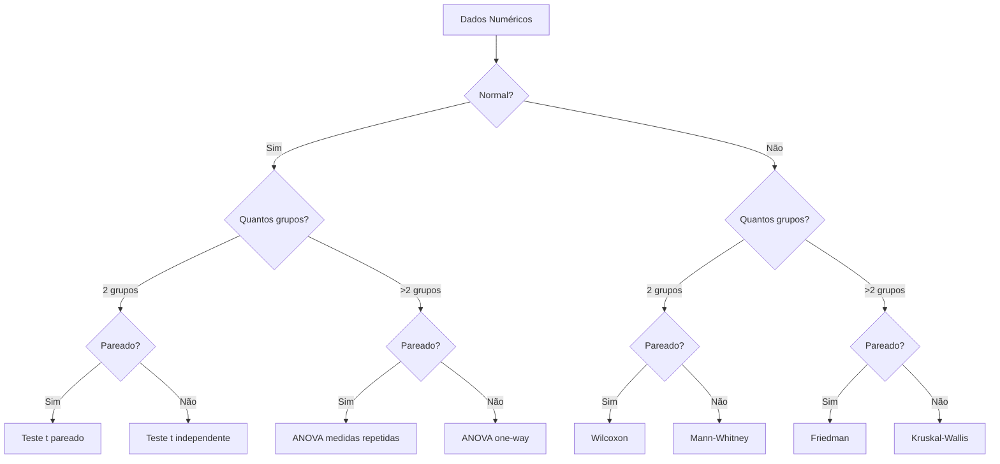
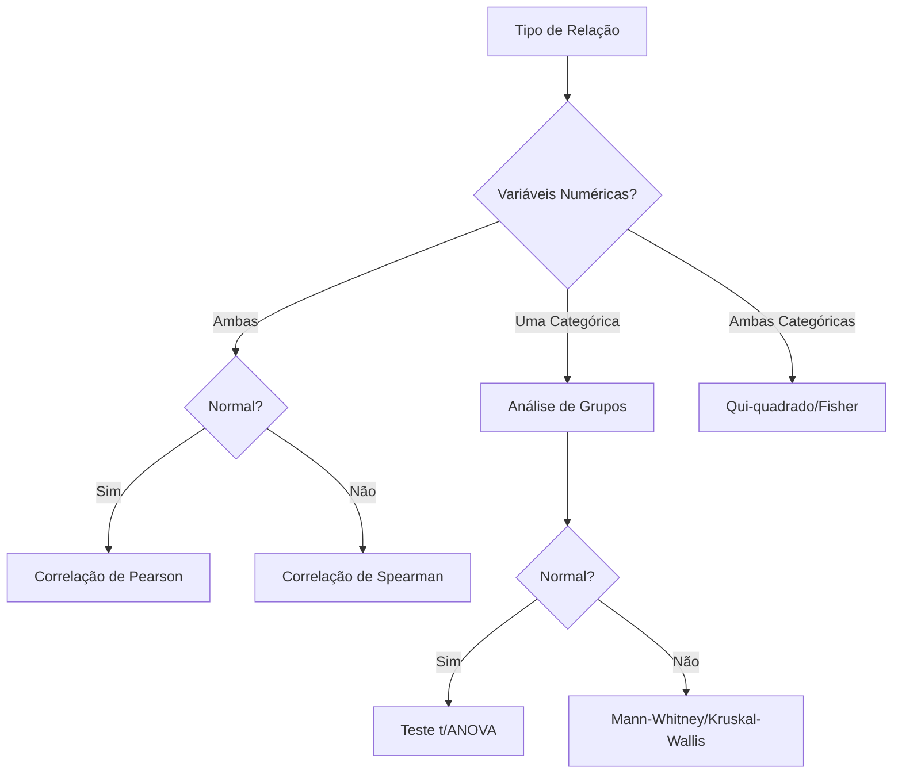

Os **Testes de Hipótese** são procedimentos estatísticos que nos permitem tomar decisões sobre parâmetros populacionais com base em dados amostrais. São ferramentas fundamentais para a inferência estatística e tomada de decisões baseadas em evidências.

  <strong>🎯 Importante:</strong> 
  Um teste de hipótese envolve duas hipóteses:
  - A hipótese nula ($H_0$): afirmação inicial que assumimos como verdadeira
  - A hipótese alternativa ($H_1$ ou $H_a$): afirmação que contradiz $H_0$

## 1. Conceitos Fundamentais

### 1.1 Estrutura Básica

Um teste de hipótese segue uma estrutura sistemática:

1. **Formulação das Hipóteses**
   - Hipótese nula ($H_0$)

   - Hipótese alternativa ($$H_1$$)

2. **Nível de Significância ($$\alpha$$)**
   - Probabilidade de erro tipo I
   - Geralmente 5% ou 1%

3. **Estatística de Teste**
   - Medida calculada a partir dos dados
   - Base para a decisão

4. **Região Crítica**
   - Valores que levam à rejeição de $$H_0$$
   - Determinada por $$\alpha$$

### 1.2 Tipos de Erro

{:style="max-width: 400px; display: block; margin: 0 auto;"}

Figura: Matriz de decisão e tipos de erro em testes de hipótese

| Decisão vs. Realidade | $$H_0$$ Verdadeira | $$H_0$$ Falsa |
|----------------------|-------------------|---------------|
| Rejeitar $$H_0$$    | Erro Tipo I ($$\alpha$$) | Decisão Correta |
| Não Rejeitar $$H_0$$| Decisão Correta | Erro Tipo II ($$\beta$$) |

## 2. Etapas do Teste de Hipótese

### 2.1 Formulação das Hipóteses

  

    
julia

    

    <button class="copy-button" onclick="copyCode(this)">
      <i class="bi bi-clipboard"></i>Copiar
    </button>
  

  

    <pre><code>using HypothesisTests

# Exemplo: Teste para média populacional
function exemplo_teste_media()
    # Dados simulados
    dados = randn(100) .+ 0.5  # Amostra normal com média 0.5
    
    # Teste t de uma amostra
    teste = OneSampleTTest(dados)
    
    println("Teste t para média populacional")
    println("-------------------------------")
    println("H₀: μ = 0")
    println("H₁: μ ≠ 0")
    println("Estatística t = ", round(test_statistic(teste), digits=4))
    println("Valor-p = ", round(pvalue(teste), digits=4))
end

exemplo_teste_media()</code></pre>
  

### 2.2 Escolha do Nível de Significância

O nível de significância ($$\alpha$$) é a probabilidade máxima aceitável de cometer um erro tipo I:

- $$\alpha = 0,05$$ (5%): Nível comum em ciências sociais
- $$\alpha = 0,01$$ (1%): Usado quando necessária maior confiança
- $$\alpha = 0,10$$ (10%): Usado em estudos preliminares

### 2.3 Cálculo da Estatística de Teste

A estatística de teste é uma medida padronizada que segue uma distribuição conhecida sob $$H_0$$:

1. **Teste Z**
   $$Z = \frac{\bar{X} - \mu_0}{\sigma/\sqrt{n}}$$

2. **Teste t**
   $$t = \frac{\bar{X} - \mu_0}{s/\sqrt{n}}$$

3. **Teste Qui-quadrado**
   $$\chi^2 = \sum_{i=1}^k \frac{(O_i - E_i)^2}{E_i}$$

## 3. Valor-p e Tomada de Decisão

### 3.1 Interpretação do Valor-p

{:style="max-width: 400px; display: block; margin: 0 auto;"}

Figura: Representação gráfica do valor-p em uma distribuição normal

O valor-p é a probabilidade de obter uma estatística de teste tão ou mais extrema que a observada, assumindo $$H_0$$ verdadeira:

- Se valor-p $$\leq \alpha$$: Rejeita-se $$H_0$$
- Se valor-p $$> \alpha$$: Não se rejeita $$H_0$$

### 3.2 Poder do Teste

O poder do teste ($$1-\beta$$) é a probabilidade de rejeitar $$H_0$$ quando ela é falsa:

  

    
julia

    

    <button class="copy-button" onclick="copyCode(this)">
      <i class="bi bi-clipboard"></i>Copiar
    </button>
  

  

    <pre><code>using Distributions

function calcular_poder_teste()
    # Parâmetros
    n = 30  # Tamanho da amostra
    α = 0.05  # Nível de significância
    μ₀ = 0  # Média sob H₀
    μₐ = 0.5  # Média sob H₁
    σ = 1  # Desvio padrão
    
    # Valor crítico
    z_crit = quantile(Normal(), 1-α/2)
    
    # Poder do teste
    β = cdf(Normal(), z_crit - (μₐ-μ₀)/(σ/√n)) - 
        cdf(Normal(), -z_crit - (μₐ-μ₀)/(σ/√n))
    poder = 1 - β
    
    println("Análise do Poder do Teste")
    println("-------------------------")
    println("Tamanho da amostra = ", n)
    println("Nível de significância = ", α)
    println("Poder do teste = ", round(poder, digits=4))
end

calcular_poder_teste()</code></pre>
  

## 4. Tipos de Testes de Hipótese

### 4.1 Testes Paramétricos

1. **Teste Z**
   - Para médias com σ conhecido
   - Amostras grandes (n ≥ 30)

2. **Teste t**
   - Para médias com σ desconhecido
   - Uma ou duas amostras
   - Amostras pareadas

3. **Teste F**
   - Comparação de variâncias
   - ANOVA

### 4.2 Testes Não-Paramétricos

1. **Teste de Wilcoxon**
   - Alternativa ao teste t
   - Não assume normalidade

2. **Teste de Mann-Whitney**
   - Comparação de duas populações
   - Dados ordinais

3. **Teste Qui-quadrado**
   - Independência
   - Aderência

## 5. Exercícios Resolvidos

### 5.1 Teste para Média Populacional

{:style="max-width: 400px; display: block; margin: 0 auto;"}

Figura: Distribuição amostral e regiões críticas

> **Problema**: Uma empresa afirma que o tempo médio de atendimento ao cliente é de 10 minutos. Um analista coletou uma amostra de 36 atendimentos e encontrou uma média de 11,2 minutos com desvio padrão de 2,4 minutos. Ao nível de significância de 5%, há evidências para rejeitar a afirmação da empresa?

**Dados**:
- $$H_0: \mu = 10$$ minutos
- $$H_1: \mu \neq 10$$ minutos
- $$\bar{x} = 11,2$$ minutos
- $$s = 2,4$$ minutos
- $$n = 36$$
- $$\alpha = 0,05$$

**Solução**:

1. Estatística de teste:
   $$t = \frac{\bar{x} - \mu_0}{s/\sqrt{n}} = \frac{11,2 - 10}{2,4/\sqrt{36}} = 3$$

2. Valor crítico (bilateral):
   $$t_{0,025;35} = \pm 2,03$$

3. Decisão:
   Como |3| > 2,03, rejeitamos $$H_0$$.

  

    
julia

    

    <button class="copy-button" onclick="copyCode(this)">
      <i class="bi bi-clipboard"></i>Copiar
    </button>
  

  

    <pre><code>function teste_tempo_atendimento()
    # Dados
    x̄ = 11.2  # Média amostral
    μ₀ = 10.0  # Média sob H₀
    s = 2.4    # Desvio padrão amostral
    n = 36     # Tamanho da amostra
    α = 0.05   # Nível de significância
    
    # Estatística t
    t_stat = (x̄ - μ₀)/(s/√n)
    
    # Valor crítico
    t_crit = quantile(TDist(n-1), 1-α/2)
    
    # Valor-p
    p_valor = 2 * (1 - cdf(TDist(n-1), abs(t_stat)))
    
    println("Teste t para Tempo de Atendimento")
    println("--------------------------------")
    println("Estatística t = ", round(t_stat, digits=4))
    println("Valor crítico = ±", round(t_crit, digits=4))
    println("Valor-p = ", round(p_valor, digits=4))
end

teste_tempo_atendimento()</code></pre>
  

### 5.2 Teste de Independência

> **Problema**: Em um estudo sobre a relação entre gênero e preferência por tipo de exercício físico, foram coletados os seguintes dados:

|            | Musculação | Cardio | Yoga |
|------------|------------|---------|------|
| Masculino  | 30         | 15      | 5    |
| Feminino   | 20         | 25      | 15   |

Teste se há independência entre gênero e preferência por exercício ao nível de 5% de significância.

**Solução**:

1. Hipóteses:
   - $$H_0$$: Gênero e preferência são independentes
   - $$H_1$$: Existe associação entre gênero e preferência

2. Frequências esperadas:
   $$E_{ij} = \frac{(total_{\text{linha } i})(total_{\text{coluna } j})}{total_{\text{geral}}}$$

3. Estatística qui-quadrado:
   $$\chi^2 = \sum_{i=1}^r \sum_{j=1}^c \frac{(O_{ij} - E_{ij})^2}{E_{ij}}$$

  

    
julia

    

    <button class="copy-button" onclick="copyCode(this)">
      <i class="bi bi-clipboard"></i>Copiar
    </button>
  

  

    <pre><code>function teste_independencia()
    # Dados observados
    O = [30 15 5;
         20 25 15]
    
    # Totais
    n = sum(O)
    r_tot = sum(O, dims=2)
    c_tot = sum(O, dims=1)
    
    # Frequências esperadas
    E = (r_tot * c_tot) / n
    
    # Estatística qui-quadrado
    χ² = sum((O .- E).^2 ./ E)
    
    # Graus de liberdade
    gl = (size(O,1)-1) * (size(O,2)-1)
    
    # Valor-p
    p_valor = 1 - cdf(Chisq(gl), χ²)
    
    println("Teste Qui-quadrado de Independência")
    println("---------------------------------")
    println("Estatística χ² = ", round(χ², digits=4))
    println("Graus de liberdade = ", gl)
    println("Valor-p = ", round(p_valor, digits=4))
end

teste_independencia()</code></pre>
  

## 6. Considerações Práticas

### 6.1 Pressupostos

1. **Normalidade**
   - Teste de Shapiro-Wilk
   - QQ-plot

2. **Independência**
   - Aleatoriedade da amostra
   - Ausência de autocorrelação

3. **Homocedasticidade**
   - Teste de Levene
   - Teste F

### 6.2 Tamanho da Amostra

O tamanho da amostra afeta:
- Poder do teste
- Precisão das estimativas
- Validade dos pressupostos

## 7. Intervalos de Confiança e Testes de Hipótese

### 7.1 Relação com Intervalos de Confiança

Os intervalos de confiança e testes de hipótese são complementares:
- Um intervalo de confiança de (1-α)% corresponde a todos os valores de μ₀ que não seriam rejeitados em um teste de nível α
- O intervalo fornece mais informação que o teste, pois indica a faixa de valores plausíveis para o parâmetro

### 7.2 Construção de Intervalos

Para uma média populacional:

$$IC_{1-\alpha} = \bar{x} \pm t_{\alpha/2, n-1} \frac{s}{\sqrt{n}}$$

  

    
julia

    

    <button class="copy-button" onclick="copyCode(this)">
      <i class="bi bi-clipboard"></i>Copiar
    </button>
  

  

    <pre><code>function calcular_ic_media()
    # Dados
    dados = randn(30) .+ 2  # Amostra com média ≈ 2
    α = 0.05
    
    # Estatísticas
    x̄ = mean(dados)
    s = std(dados)
    n = length(dados)
    
    # Valor crítico t
    t_crit = quantile(TDist(n-1), 1-α/2)
    
    # Intervalo de confiança
    margem_erro = t_crit * (s/√n)
    ic_inf = x̄ - margem_erro
    ic_sup = x̄ + margem_erro
    
    println("Intervalo de Confiança (95%)")
    println("----------------------------")
    println("Limite inferior: ", round(ic_inf, digits=4))
    println("Limite superior: ", round(ic_sup, digits=4))
end

calcular_ic_media()</code></pre>
  

## 8. Exemplos Práticos Adicionais

### 8.1 Teste para Proporção

> **Problema**: Uma empresa de marketing digital afirma que sua nova estratégia de e-mail marketing tem taxa de conversão de 15%. Em uma amostra de 200 e-mails enviados, 40 resultaram em conversão. Teste esta afirmação ao nível de 5% de significância.

**Solução**:

1. Hipóteses:
   - H₀: p = 0,15
   - H₁: p ≠ 0,15

2. Estatística de teste:
   $$Z = \frac{\hat{p} - p_0}{\sqrt{\frac{p_0(1-p_0)}{n}}}$$

  

    
julia

    

    <button class="copy-button" onclick="copyCode(this)">
      <i class="bi bi-clipboard"></i>Copiar
    </button>
  

  

    <pre><code>function teste_proporcao()
    # Dados
    n = 200        # Tamanho da amostra
    x = 40         # Sucessos
    p₀ = 0.15      # Proporção sob H₀
    α = 0.05       # Nível de significância
    
    # Proporção amostral
    p̂ = x/n
    
    # Estatística Z
    z_stat = (p̂ - p₀)/√(p₀*(1-p₀)/n)
    
    # Valor-p
    p_valor = 2 * (1 - cdf(Normal(), abs(z_stat)))
    
    println("Teste Z para Proporção")
    println("---------------------")
    println("Proporção amostral = ", round(p̂, digits=4))
    println("Estatística Z = ", round(z_stat, digits=4))
    println("Valor-p = ", round(p_valor, digits=4))
end

teste_proporcao()</code></pre>
  

### 8.2 Teste de Correlação

> **Problema**: Queremos verificar se existe correlação significativa entre as horas de estudo e as notas dos alunos.

  

    
julia

    

    <button class="copy-button" onclick="copyCode(this)">
      <i class="bi bi-clipboard"></i>Copiar
    </button>
  

  

    <pre><code>function teste_correlacao()
    # Dados simulados
    horas = [2, 3, 4, 3, 5, 6, 4, 5, 6, 7]
    notas = [65, 70, 75, 68, 80, 85, 72, 78, 88, 90]
    
    # Coeficiente de correlação
    r = cor(horas, notas)
    
    # Estatística t
    n = length(horas)
    t_stat = r * √((n-2)/(1-r^2))
    
    # Valor-p
    p_valor = 2 * (1 - cdf(TDist(n-2), abs(t_stat)))
    
    println("Teste de Correlação")
    println("------------------")
    println("Correlação = ", round(r, digits=4))
    println("Estatística t = ", round(t_stat, digits=4))
    println("Valor-p = ", round(p_valor, digits=4))
end

teste_correlacao()</code></pre>
  

## 9. Erros Comuns e Boas Práticas

### 9.1 Erros Comuns

1. **Interpretação Incorreta do Valor-p**
   - O valor-p NÃO é a probabilidade de H₀ ser verdadeira
   - O valor-p é a probabilidade de obter dados tão ou mais extremos que os observados, assumindo H₀ verdadeira

2. **Confusão entre Significância Estatística e Prática**
   - Significância estatística não implica relevância prática
   - Com amostras muito grandes, diferenças pequenas podem ser estatisticamente significativas

3. **Múltiplos Testes sem Correção**
   - Realizar múltiplos testes aumenta a chance de erro tipo I
   - Use correções como Bonferroni ou controle FDR

### 9.2 Boas Práticas

1. **Planejamento do Estudo**
   - Defina hipóteses antes da coleta de dados
   - Calcule o tamanho da amostra necessário
   - Estabeleça critérios de significância prática

2. **Análise de Dados**
   - Verifique pressupostos antes do teste
   - Use visualizações para complementar a análise
   - Reporte intervalos de confiança junto com valores-p

3. **Comunicação dos Resultados**
   - Apresente estatísticas descritivas
   - Reporte tamanhos de efeito
   - Discuta limitações do estudo

## 10. Recursos Adicionais

### 10.1 Ferramentas Online

1. [Calculadora de Poder Estatístico](https://www.powerandsamplesize.com/)
2. [Seletor de Teste Estatístico](https://stats.idre.ucla.edu/other/mult-pkg/whatstat/)
3. [Visualizador de Distribuições](https://seeing-theory.brown.edu/probability-distributions/index.html)

### 10.2 Pacotes Estatísticos

1. **R**
   - stats
   - pwr
   - coin

2. **Python**
   - scipy.stats
   - statsmodels
   - pingouin

3. **Julia**
   - HypothesisTests.jl
   - StatisticalTests.jl
   - Power.jl

## Referências Adicionais

6. Wasserman, L. **All of Statistics: A Concise Course in Statistical Inference**. Springer, 2004.
7. Lehmann, E. L.; Romano, J. P. **Testing Statistical Hypotheses**. 3ª ed. Springer, 2005.
8. Rice, J. A. **Mathematical Statistics and Data Analysis**. 3ª ed. Thomson Brooks/Cole, 2007.
9. Efron, B.; Hastie, T. **Computer Age Statistical Inference**. Cambridge University Press, 2016.
10. Good, P. I.; Hardin, J. W. **Common Errors in Statistics (and How to Avoid Them)**. 4ª ed. Wiley, 2012.

## 11. Guia para Escolha do Teste Estatístico

### 11.1 Árvore de Decisão

{:style="max-width: 600px; display: block; margin: 0 auto;"}

Figura: Árvore de decisão para seleção do teste estatístico apropriado

### 11.2 Critérios de Seleção

1. **Tipo de Variável**
   
   | Tipo de Variável | Exemplos | Testes Apropriados |
   |------------------|----------|-------------------|
   | Nominal | Gênero, Cor | Qui-quadrado, Teste exato de Fisher |
   | Ordinal | Escala Likert | Mann-Whitney, Kruskal-Wallis |
   | Intervalar/Razão | Altura, Peso | Teste t, ANOVA |

2. **Número de Grupos**
   
   | Número de Grupos | Paramétrico | Não-Paramétrico |
   |-----------------|-------------|-----------------|
   | 2 grupos independentes | Teste t independente | Mann-Whitney |
   | 2 grupos pareados | Teste t pareado | Wilcoxon |
   | > 2 grupos independentes | ANOVA | Kruskal-Wallis |
   | > 2 grupos pareados | ANOVA medidas repetidas | Friedman |

3. **Pressupostos dos Testes**

   

   <strong>🔍 Verificação de Pressupostos:</strong>
   
   - Normalidade: Shapiro-Wilk ou Kolmogorov-Smirnov
   - Homocedasticidade: Levene ou Bartlett
   - Independência: Durbin-Watson
   

### 11.3 Fluxograma de Decisão por Objetivo

#### 11.3.1 Comparação de Médias/Medianas

#### 11.3.2 Análise de Relações

### 11.4 Tabela de Decisão Rápida

| Objetivo | Condições | Teste Recomendado |
|----------|-----------|-------------------|
| Comparar média com valor de referência | Normal | Teste t uma amostra |
| Comparar média com valor de referência | Não normal | Wilcoxon uma amostra |
| Comparar duas médias (independentes) | Normal + Variâncias iguais | Teste t independente |
| Comparar duas médias (independentes) | Normal + Variâncias diferentes | Welch t-test |
| Comparar duas médias (pareadas) | Normal | Teste t pareado |
| Comparar > 2 médias | Normal + Homocedástico | ANOVA |
| Comparar proporções | n grande | Teste Z proporções |
| Comparar proporções | n pequeno | Teste exato de Fisher |
| Verificar independência | Categóricas | Qui-quadrado |
| Avaliar correlação | Normal bivariada | Pearson |
| Avaliar correlação | Não normal | Spearman |

### 11.5 Exemplos Práticos de Seleção

1. **Exemplo: Eficácia de Medicamento**
   - Variável: Pressão arterial (numérica)
   - Grupos: Antes e depois (pareado)
   - Distribuição: Normal
   - **Teste escolhido**: Teste t pareado

2. **Exemplo: Preferência por Marca**
   - Variável: Escolha de marca (categórica)
   - Grupos: Múltiplas marcas
   - **Teste escolhido**: Qui-quadrado

  

    
julia

    

    <button class="copy-button" onclick="copyCode(this)">
      <i class="bi bi-clipboard"></i>Copiar
    </button>
  

  

    <pre><code>using HypothesisTests

function exemplo_selecao_teste()
    # Exemplo 1: Teste t pareado
    antes = [120, 122, 118, 125, 124]
    depois = [115, 118, 112, 120, 119]
    
    # Teste de normalidade primeiro
    println("Teste de Normalidade (diferenças):")
    dif = depois .- antes
    normal_test = ShapiroWilkTest(dif)
    println("p-valor = ", round(pvalue(normal_test), digits=4))
    
    # Se normal, proceder com teste t pareado
    if pvalue(normal_test) > 0.05
        paired_test = OneSampleTTest(dif)
        println("\nTeste t Pareado:")
        println("Estatística t = ", round(test_statistic(paired_test), digits=4))
        println("p-valor = ", round(pvalue(paired_test), digits=4))
    else
        # Se não normal, usar Wilcoxon
        wilcox_test = SignedRankTest(depois, antes)
        println("\nTeste de Wilcoxon:")
        println("p-valor = ", round(pvalue(wilcox_test), digits=4))
    end
end

exemplo_selecao_teste()</code></pre>
  

### 11.6 Considerações Importantes

1. **Tamanho da Amostra**
   - n < 30: Verificar normalidade é crucial
   - n ≥ 30: Testes paramétricos são mais robustos

2. **Violação de Pressupostos**
   - Leve: Testes paramétricos ainda são robustos
   - Severa: Optar por alternativas não-paramétricas

3. **Poder Estatístico**
   - Testes paramétricos: Maior poder se pressupostos atendidos
   - Testes não-paramétricos: Mais seguros se dúvida sobre pressupostos

4. **Interpretabilidade**
   - Considerar a facilidade de interpretação
   - Balancear rigor estatístico com praticidade

## 12. Testes Paramétricos vs. Não Paramétricos

### 12.1 Testes Paramétricos

Os testes paramétricos são procedimentos estatísticos que assumem que os dados seguem uma distribuição de probabilidade específica (geralmente a distribuição normal) e fazem inferências sobre os parâmetros dessa distribuição.

#### 12.1.1 Características Principais

1. **Pressupostos**
   - Normalidade dos dados
   - Homogeneidade das variâncias (homocedasticidade)
   - Independência das observações
   - Variáveis contínuas ou intervalares

2. **Vantagens**
   - Maior poder estatístico quando os pressupostos são atendidos
   - Estimativas mais precisas
   - Capacidade de fazer inferências sobre parâmetros populacionais

3. **Exemplos de Testes Paramétricos**

   | Teste | Uso | Pressuposto Principal |
   |-------|-----|----------------------|
   | Teste t | Comparação de médias | Normalidade |
   | ANOVA | Comparação de múltiplas médias | Normalidade e homocedasticidade |
   | Correlação de Pearson | Associação linear | Normalidade bivariada |
   | Regressão Linear | Relação entre variáveis | Normalidade dos resíduos |

#### 12.1.2 Verificação de Pressupostos

  

    
julia

    

    <button class="copy-button" onclick="copyCode(this)">
      <i class="bi bi-clipboard"></i>Copiar
    </button>
  

  

    <pre><code>using HypothesisTests
using Statistics

function verificar_pressupostos()
    # Dados simulados
    dados = randn(30) .* 2 .+ 1
    
    # 1. Teste de Normalidade
    normalidade = ShapiroWilkTest(dados)
    
    # 2. Teste de Homocedasticidade (entre dois grupos)
    grupo1 = randn(20) .* 2
    grupo2 = randn(20) .* 2
    homog = VarianceFTest(grupo1, grupo2)
    
    println("Verificação de Pressupostos")
    println("---------------------------")
    println("Teste de Normalidade:")
    println("Estatística W = ", round(test_statistic(normalidade), digits=4))
    println("p-valor = ", round(pvalue(normalidade), digits=4))
    println("\nTeste de Homocedasticidade:")
    println("Estatística F = ", round(test_statistic(homog), digits=4))
    println("p-valor = ", round(pvalue(homog), digits=4))
end

verificar_pressupostos()</code></pre>
  

### 12.2 Testes Não Paramétricos

Os testes não paramétricos são procedimentos estatísticos que não exigem pressupostos sobre a distribuição dos dados. São também conhecidos como "testes livres de distribuição".

#### 12.2.1 Características Principais

1. **Vantagens**
   - Mais flexíveis quanto à distribuição dos dados
   - Robustos a outliers
   - Aplicáveis a dados ordinais
   - Úteis para amostras pequenas

2. **Limitações**
   - Menor poder estatístico que testes paramétricos
   - Não fazem inferências sobre parâmetros específicos
   - Podem perder informação ao usar ranks

3. **Exemplos de Testes Não Paramétricos**

   | Teste Não Paramétrico | Equivalente Paramétrico | Uso |
   |----------------------|------------------------|-----|
   | Mann-Whitney U | Teste t independente | Comparar dois grupos |
   | Wilcoxon | Teste t pareado | Comparar medidas repetidas |
   | Kruskal-Wallis | ANOVA one-way | Comparar múltiplos grupos |
   | Spearman | Correlação de Pearson | Correlação por ranks |

#### 12.2.2 Exemplo Comparativo

  

    
julia

    

    <button class="copy-button" onclick="copyCode(this)">
      <i class="bi bi-clipboard"></i>Copiar
    </button>
  

  

    <pre><code>function comparar_testes()
    # Dados não normais (distribuição exponencial)
    grupo1 = rand(Exponential(1), 20)
    grupo2 = rand(Exponential(1.5), 20)
    
    # Teste paramétrico (t)
    teste_t = UnequalVarianceTTest(grupo1, grupo2)
    
    # Teste não paramétrico (Mann-Whitney)
    teste_mw = MannWhitneyUTest(grupo1, grupo2)
    
    println("Comparação entre Testes")
    println("----------------------")
    println("Teste t:")
    println("Estatística t = ", round(test_statistic(teste_t), digits=4))
    println("p-valor = ", round(pvalue(teste_t), digits=4))
    println("\nTeste de Mann-Whitney:")
    println("Estatística U = ", round(test_statistic(teste_mw), digits=4))
    println("p-valor = ", round(pvalue(teste_mw), digits=4))
end

comparar_testes()</code></pre>
  

### 12.3 Quando Usar Cada Tipo de Teste?

#### 12.3.1 Use Testes Paramétricos Quando:

1. **Dados Atendem aos Pressupostos**
   - Distribuição normal ou aproximadamente normal
   - Variâncias homogêneas
   - Tamanho amostral adequado (n ≥ 30)

2. **Precisão é Crucial**
   - Necessidade de estimativas precisas
   - Inferências sobre parâmetros populacionais
   - Poder estatístico é prioridade

#### 12.3.2 Use Testes Não Paramétricos Quando:

1. **Violação de Pressupostos**
   - Dados não normais
   - Heteroscedasticidade
   - Presença de outliers significativos

2. **Características dos Dados**
   - Amostra pequena (n < 30)
   - Dados ordinais ou rankings
   - Distribuição muito assimétrica

  <strong>⚠️ Dica Importante:</strong> 
  Em caso de dúvida entre teste paramétrico e não paramétrico:
  1. Verifique os pressupostos rigorosamente
  2. Se houver violação moderada, o teste paramétrico ainda pode ser usado
  3. Se houver violação severa, opte pelo teste não paramétrico
  4. Considere reportar ambos os resultados se forem divergentes

### 12.4 Tabela Comparativa Detalhada

| Aspecto | Testes Paramétricos | Testes Não Paramétricos |
|---------|-------------------|------------------------|
| Pressupostos | Mais rigorosos | Mais flexíveis |
| Poder Estatístico | Maior (quando pressupostos atendidos) | Menor |
| Robustez | Menor | Maior |
| Interpretação | Mais direta | Menos intuitiva |
| Tamanho Amostral | Preferível n ≥ 30 | Funciona bem com n < 30 |
| Tipo de Dados | Intervalares/Razão | Qualquer tipo |
| Outliers | Sensível | Robusto |
| Precisão | Maior | Menor |

### 12.5 Exemplos de Aplicação

1. **Cenário: Dados Normais, n = 50**
   - Escolha: Teste paramétrico
   - Razão: Pressupostos atendidos, maior poder

2. **Cenário: Dados Assimétricos, n = 15**
   - Escolha: Teste não paramétrico
   - Razão: Amostra pequena, não normalidade

3. **Cenário: Escala Likert**
   - Escolha: Teste não paramétrico
   - Razão: Dados ordinais

4. **Cenário: Medidas Físicas, n = 100**
   - Escolha: Teste paramétrico
   - Razão: Dados contínuos, amostra grande
