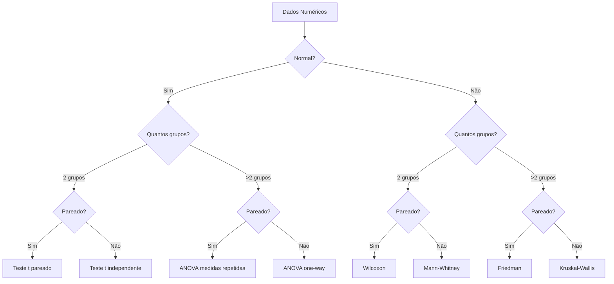
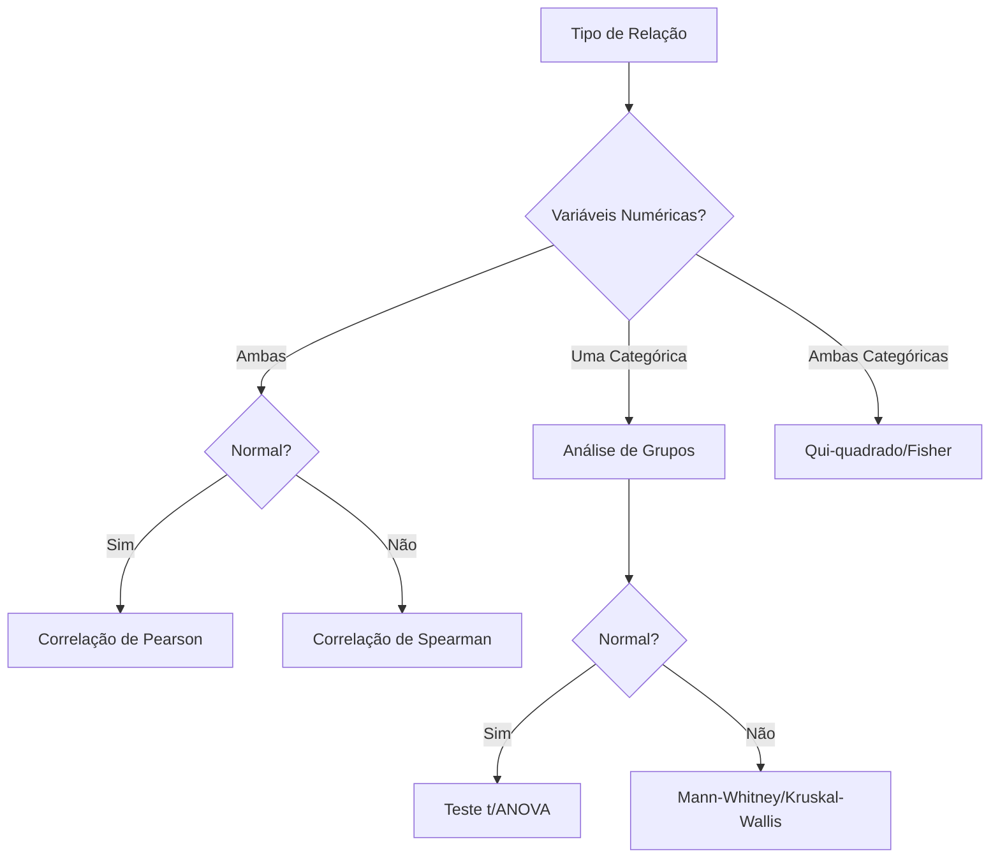

Os **Testes de Hipótese** são procedimentos estatísticos que nos permitem tomar decisões sobre parâmetros populacionais com base em dados amostrais. São ferramentas fundamentais para a inferência estatística e tomada de decisões baseadas em evidências.

O arcabouço moderno foi desenvolvido principalmente por **Jerzy Neyman e Egon Pearson** nas décadas de 1920–1930, formalizando a distinção entre $H_0$ e $H_1$ e o conceito de região crítica. Ronald Fisher, de forma independente, desenvolveu a abordagem via p-valor. Ambas as perspectivas coexistem e se complementam na prática estatística contemporânea.

A lógica central é a **prova por contradição probabilística**: assume-se provisoriamente que $H_0$ é verdadeira e verifica-se se os dados observados são compatíveis com essa suposição. Se a probabilidade de observar resultados tão ou mais extremos sob $H_0$ for menor que $\alpha$, rejeita-se $H_0$ em favor de $H_1$.

  <strong>🎯 Estrutura formal (Neyman–Pearson):</strong>  
  Um teste de hipótese especifica:
  <ul>
    <li>A <strong>hipótese nula</strong> ($H_0$): afirmação inicial que assume ausência de efeito ou diferença</li>
    <li>A <strong>hipótese alternativa</strong> ($H_1$): o que se deseja detectar; contradiz $H_0$</li>
    <li>Uma <strong>estatística de teste</strong> $T(\mathbf{X})$ com distribuição conhecida sob $H_0$</li>
    <li>Uma <strong>região crítica</strong> $\mathcal{RC}$ tal que $P(T \in \mathcal{RC} \mid H_0) = \alpha$</li>
  </ul>
  <strong>Regra de decisão:</strong> Rejeitar $H_0$ se e somente se $T(\mathbf{x}_{\text{obs}}) \in \mathcal{RC}$.

## 1. Conceitos Fundamentais

### 1.1 Estrutura Básica

Um teste de hipótese segue uma estrutura sistemática:

1. **Formulação das Hipóteses**
   - Hipótese nula ($H_0$)

   - Hipótese alternativa ($$H_1$$)

2. **Nível de Significância ($$\alpha$$)**
   - Probabilidade de erro tipo I
   - Geralmente 5% ou 1%

3. **Estatística de Teste**
   - Medida calculada a partir dos dados
   - Base para a decisão

4. **Região Crítica**
   - Valores que levam à rejeição de $H_0$, determinada por $\alpha$
   - $\mathcal{RC} = \{|t| > t_{\alpha/2}\}$ (bilateral) ou $\{t > t_\alpha\}$ (unilateral direito)

5. **Cálculo do p-valor**
   - Probabilidade de observar resultado tão ou mais extremo que o observado, sob $H_0$
   - Escala contínua de evidência contra $H_0$

6. **Conclusão e interpretação**
   - Rejeitar $H_0$ se p-valor $\leq \alpha$ (equivalente a $t_{\text{obs}} \in \mathcal{RC}$)
   - Não rejeitar **não** significa "aceitar $H_0$" — significa apenas falta de evidência suficiente

### 1.3 Tipos de Teste: Bilateral e Unilateral

A escolha entre bilateral e unilateral depende da hipótese alternativa formulada **antes** da coleta dos dados.

<table style="border-collapse: collapse; margin: 0 auto; min-width: 580px;">
  <thead style="background: #e3f2fd;">
    <tr>
      <th style="border: 1px solid #bbb; padding: 8px;">Tipo</th>
      <th style="border: 1px solid #bbb; padding: 8px;">Hipóteses</th>
      <th style="border: 1px solid #bbb; padding: 8px;">Região crítica</th>
      <th style="border: 1px solid #bbb; padding: 8px;">p-valor</th>
      <th style="border: 1px solid #bbb; padding: 8px;">Quando usar</th>
    </tr>
  </thead>
  <tbody>
    <tr>
      <td style="border: 1px solid #bbb; padding: 8px;"><strong>Bilateral</strong></td>
      <td style="border: 1px solid #bbb; padding: 8px;">$H_1: \theta \neq \theta_0$</td>
      <td style="border: 1px solid #bbb; padding: 8px;">$|t| > t_{\alpha/2}$</td>
      <td style="border: 1px solid #bbb; padding: 8px;">$2P(T > |t_{\text{obs}}|)$</td>
      <td style="border: 1px solid #bbb; padding: 8px;">Qualquer desvio é relevante</td>
    </tr>
    <tr>
      <td style="border: 1px solid #bbb; padding: 8px;"><strong>Unilateral direito</strong></td>
      <td style="border: 1px solid #bbb; padding: 8px;">$H_1: \theta > \theta_0$</td>
      <td style="border: 1px solid #bbb; padding: 8px;">$t > t_{\alpha}$</td>
      <td style="border: 1px solid #bbb; padding: 8px;">$P(T > t_{\text{obs}})$</td>
      <td style="border: 1px solid #bbb; padding: 8px;">Só interessa desvio para cima</td>
    </tr>
    <tr>
      <td style="border: 1px solid #bbb; padding: 8px;"><strong>Unilateral esquerdo</strong></td>
      <td style="border: 1px solid #bbb; padding: 8px;">$H_1: \theta < \theta_0$</td>
      <td style="border: 1px solid #bbb; padding: 8px;">$t < -t_{\alpha}$</td>
      <td style="border: 1px solid #bbb; padding: 8px;">$P(T < t_{\text{obs}})$</td>
      <td style="border: 1px solid #bbb; padding: 8px;">Só interessa desvio para baixo</td>
    </tr>
  </tbody>
</table>

<strong>Cuidado — p-hacking de direção:</strong> Um teste unilateral tem maior poder para detectar desvios na direção especificada, mas <em>não detecta</em> desvios na direção oposta. A escolha do tipo deve ser justificada pelo contexto <em>antes</em> de ver os dados — escolher o tipo <em>após</em> observar a direção dos dados é uma forma de p-hacking.

### 1.2 Tipos de Erro

  <table style="min-width: 380px; border-collapse: collapse; margin: 0 auto;">
    <thead style="background: #e3f2fd;">
      <tr>
        <th style="border: 1px solid #bbb; padding: 8px;">Decisão vs. Realidade</th>
        <th style="border: 1px solid #bbb; padding: 8px;">H0 Verdadeira</th>
        <th style="border: 1px solid #bbb; padding: 8px;">H0 Falsa</th>
      </tr>
    </thead>
    <tbody>
      <tr>
        <td style="border: 1px solid #bbb; padding: 8px;">Rejeitar H0</td>
        <td style="border: 1px solid #bbb; padding: 8px;">Erro Tipo I (&alpha;)</td>
        <td style="border: 1px solid #bbb; padding: 8px;">Decisão Correta</td>
      </tr>
      <tr>
        <td style="border: 1px solid #bbb; padding: 8px;">Não Rejeitar H0</td>
        <td style="border: 1px solid #bbb; padding: 8px;">Decisão Correta</td>
        <td style="border: 1px solid #bbb; padding: 8px;">Erro Tipo II (&beta;)</td>
      </tr>
    </tbody>
  </table>

### 🔴 Erro Tipo I (α)

- **O que é:** Rejeitamos $H_0$ mesmo ela sendo verdadeira.
- **Exemplo:** Suponha que um novo medicamento **não** seja mais eficaz que o atual (ou seja, $H_0$ é verdadeira), mas ao aplicar o teste, os dados indicam falsamente que ele **é mais eficaz**, levando à rejeição de $H_0$.
- **Consequência:** Assumimos que existe um efeito ou diferença quando na realidade não há.
- **Probabilidade:** Representada por **α**, geralmente fixada em 5% (0,05).

---

### ✅ Decisão Correta (quando H₀ é verdadeira e não a rejeitamos)

- **O que é:** Não rejeitamos $H_0$ e ela realmente é verdadeira.
- **Exemplo:** Um medicamento realmente não é melhor que o outro, e o teste estatístico confirma isso.
- **Consequência:** Decisão correta, sem erro cometido.

---

### ✅ Decisão Correta (quando H₀ é falsa e a rejeitamos)

- **O que é:** Rejeitamos $H_0$ e ela de fato é falsa.
- **Exemplo:** Um novo tratamento realmente é mais eficaz, e o teste estatístico detecta essa diferença.
- **Consequência:** Decisão correta, identificando corretamente o efeito.

---

### 🔵 Erro Tipo II (β)

- **O que é:** Não rejeitamos $H_0$, mesmo ela sendo falsa.
- **Exemplo:** Um novo método é realmente melhor que o atual, mas o teste não encontra evidências suficientes e $H_0$ não é rejeitada.
- **Consequência:** Perdemos a chance de reconhecer uma melhoria ou efeito real.
- **Probabilidade:** Representada por **β**. Quanto menor o β, maior o **poder do teste** (capacidade de detectar um efeito real).

---

 

  

    
julia

    

    <button class="copy-button" onclick="copyCode(this)">
      <i class="bi bi-clipboard"></i>Copiar
    </button>
  

  

    <pre><code>using Plots
using Distributions

# Distribuições
μ0 = 0
μ1 = 1.5
σ = 1
α = 0.05

dist_H0 = Normal(μ0, σ)
dist_H1 = Normal(μ1, σ)

# Valor crítico para teste unilateral (cauda direita)
z_crit = quantile(dist_H0, 1 - α)

# Cálculo do erro tipo II (β) e poder do teste
β = cdf(dist_H1, z_crit)
poder = 1 - β

# Curvas
x = -3:0.01:5
y_H0 = pdf.(dist_H0, x)
y_H1 = pdf.(dist_H1, x)

# Inicia o gráfico com H0 e H1
plot(x, y_H0, label="H₀: N(0,1)", lw=2, color=:steelblue, legend=:topright)
plot!(x, y_H1, label="H₁: N(1.5,1)", lw=2, color=:crimson)

# Área de erro tipo I (α)
fill_x1 = x[x .>= z_crit]
fill_y1 = pdf.(dist_H0, fill_x1)
plot!(fill_x1, fill_y1, fillrange=0, fillalpha=0.4, label="Erro Tipo I (α)", color=:steelblue)

# Área de erro tipo II (β)
fill_x2 = x[x .<= z_crit]
fill_y2 = pdf.(dist_H1, fill_x2)
plot!(fill_x2, fill_y2, fillrange=0, fillalpha=0.4, label="Erro Tipo II (β)", color=:crimson)

# Linha de corte
vline!([z_crit], label="Valor crítico", lw=2, linestyle=:dash, color=:black)

# Anotações
annotate!(z_crit + 0.5, 0.05, text("Área α", :black, 10))
annotate!(z_crit - 1.0, 0.08, text("Área β", :black, 10))
annotate!(μ0, 0.4, text("H₀", :black, 12, :center))
annotate!(μ1, 0.3, text("H₁", :black, 12, :center))

# Adiciona os resultados como curvas invisíveis só para aparecer no legend
plot!([NaN], [NaN], label="Valor crítico: $(round(z_crit, digits=4))")
plot!([NaN], [NaN], label="Erro Tipo II (β): $(round(β, digits=4))")
plot!([NaN], [NaN], label="Poder do teste: $(round(poder, digits=4))")

# Eixos e título
xlabel!("Estatística de teste")
ylabel!("Densidade")
title!("Visualização dos Erros Tipo I (α) e Tipo II (β)")</code></pre>
  

---

### 📌 1. Valor crítico (zₐ = 1.6449)
Esse é o ponto de corte da curva da hipótese nula (H₀) para rejeitar ou não rejeitar a hipótese.

Como o teste é unilateral à direita e o nível de significância é α = 0.05, usamos:

  
# Saída

  
z_crit = quantile(Normal(0,1), 1 - α) = quantile(Normal(0,1), 0.95) ≈ 1.6449

**Em termos práticos:**
Se sua estatística de teste (z-calculado) for maior que 1.6449, você rejeita H₀.

---

### 📌 2. Erro Tipo II (β = 0.5576)
Esse valor representa a probabilidade de não rejeitar H₀ quando H₁ é verdadeira.

Em outras palavras, é o risco de falhar em detectar um efeito real (ou seja, perder uma descoberta importante).

**Aqui:**
Existe uma probabilidade de **55,76%** de você não detectar a diferença real entre H₀ e H₁ (com μ₀ = 0 e μ₁ = 1.5).

---

### 📌 3. Poder do teste (1 - β = 0.4424)
O poder do teste representa a capacidade de detectar corretamente um efeito verdadeiro.

**Aqui:**
O teste tem **44,24%** de chance de detectar corretamente que H₁ é verdadeira quando ela realmente é.

Em geral, deseja-se um poder ≥ 80% (ou seja, β ≤ 0.20), então:

⚠️ Esse teste está com poder baixo, o que significa que ele não é muito eficaz para detectar a diferença especificada entre μ₀ e μ₁.

---

### 🔎 Conclusão interpretativa

  <table style="min-width: 380px; border-collapse: collapse; margin: 0 auto; border: 1px solid #ccc;">
    <thead style="background: #e3f2fd;">
      <tr>
        <th style="border: 1px solid #ccc; padding: 8px; text-align: left;">Valor</th>
        <th style="border: 1px solid #ccc; padding: 8px; text-align: left;">Interpretação</th>
      </tr>
    </thead>
    <tbody>
      <tr>
        <td style="border: 1px solid #ccc; padding: 8px;">z_crit = 1.6449</td>
        <td style="border: 1px solid #ccc; padding: 8px;">Limite a partir do qual rejeitamos H₀</td>
      </tr>
      <tr>
        <td style="border: 1px solid #ccc; padding: 8px;">β = 0.5576</td>
        <td style="border: 1px solid #ccc; padding: 8px;">Alta chance de errar ao não rejeitar H₀ quando H₁ é verdadeira</td>
      </tr>
      <tr>
        <td style="border: 1px solid #ccc; padding: 8px;">Poder = 0.4424</td>
        <td style="border: 1px solid #ccc; padding: 8px;">Baixa chance de detectar a verdade (poder fraco)</td>
      </tr>
    </tbody>
  </table>

💡 O que fazer se o poder está baixo?

Você pode:
- Aumentar o tamanho da amostra
- Aumentar a diferença entre μ₀ e μ₁
- Reduzir a variabilidade (σ)
- Aceitar um nível de significância α maior (com cuidado)

---

  <strong>A imagem acima ilustra, de forma didática e bem-humorada, os quatro possíveis resultados de um teste diagnóstico ou de hipótese, usando o exemplo de um teste de gravidez. Essa estrutura é chamada de matriz de decisão ou matriz de confusão, muito usada em Estatística, Machine Learning e Testes de Hipóteses.</strong>

  <h4 style="margin-top:1em; color:#4361ee;">🧠 Matriz de Decisão (Confusão)</h4>
  <table style="min-width: 380px; border-collapse: collapse; margin: 0 auto;">
    <thead style="background: #e3f2fd;">
      <tr>
        <th style="border: 1px solid #bbb; padding: 8px;">Condição Real</th>
        <th style="border: 1px solid #bbb; padding: 8px;">Grávida</th>
        <th style="border: 1px solid #bbb; padding: 8px;">Não Grávida</th>
      </tr>
    </thead>
    <tbody>
      <tr>
        <td style="border: 1px solid #bbb; padding: 8px;">Teste diz grávida</td>
        <td style="border: 1px solid #bbb; padding: 8px;">✅ Verdadeiro Positivo (VP)</td>
        <td style="border: 1px solid #bbb; padding: 8px;">❌ Falso Positivo (FP) - Erro Tipo I</td>
      </tr>
      <tr>
        <td style="border: 1px solid #bbb; padding: 8px;">Teste diz não grávida</td>
        <td style="border: 1px solid #bbb; padding: 8px;">❌ Falso Negativo (FN) - Erro Tipo II</td>
        <td style="border: 1px solid #bbb; padding: 8px;">✅ Verdadeiro Negativo (VN)</td>
      </tr>
    </tbody>
  </table>

  <ul style="margin-top:1em;">
    <li><b>🟢 Verdadeiro Positivo (VP):</b> Pessoa está grávida e o teste detecta corretamente. <i>Exemplo: Mulher grávida, médico diz: “Você está grávida”. Decisão correta.</i></li>
    <li><b>🟢 Verdadeiro Negativo (VN):</b> Pessoa não está grávida e o teste confirma isso. <i>Exemplo: Homem idoso, médico diz: “Você não está grávida”. Decisão correta.</i></li>
    <li><b>🔴 Falso Positivo (FP) – Erro Tipo I:</b> Pessoa não está grávida, mas o teste diz que está. <i>Exemplo: Homem idoso, médico diz: “Você está grávida”. Erro tipo I: Rejeita a hipótese nula quando ela é verdadeira. No contexto de testes de hipótese: Concluímos que há efeito quando não há.</i></li>
    <li><b>🔴 Falso Negativo (FN) – Erro Tipo II:</b> Pessoa está grávida, mas o teste não detecta. <i>Exemplo: Mulher grávida, médico diz: “Você não está grávida”. Erro tipo II: Não rejeita a hipótese nula quando ela é falsa. No contexto de testes de hipótese: Deixa de detectar um efeito que existe.</i></li>
  </ul>

  <h4 style="margin-top:1.5em; color:#4361ee;">📊 Relação com Testes de Hipótese</h4>
  <table style="min-width: 380px; border-collapse: collapse; margin: 0 auto;">
    <thead style="background: #e3f2fd;">
      <tr>
        <th style="border: 1px solid #bbb; padding: 8px;">Termo Estatístico</th>
        <th style="border: 1px solid #bbb; padding: 8px;">Interpretação</th>
      </tr>
    </thead>
    <tbody>
      <tr>
        <td style="border: 1px solid #bbb; padding: 8px;">Hipótese Nula (H₀)</td>
        <td style="border: 1px solid #bbb; padding: 8px;">Ex: “A pessoa não está grávida”</td>
      </tr>
      <tr>
        <td style="border: 1px solid #bbb; padding: 8px;">Hipótese Alternativa (H₁)</td>
        <td style="border: 1px solid #bbb; padding: 8px;">Ex: “A pessoa está grávida”</td>
      </tr>
      <tr>
        <td style="border: 1px solid #bbb; padding: 8px;">Erro Tipo I (&alpha;)</td>
        <td style="border: 1px solid #bbb; padding: 8px;">Rejeitar H₀ quando H₀ é verdadeira (falso positivo)</td>
      </tr>
      <tr>
        <td style="border: 1px solid #bbb; padding: 8px;">Erro Tipo II (&beta;)</td>
        <td style="border: 1px solid #bbb; padding: 8px;">Não rejeitar H₀ quando H₀ é falsa (falso negativo)</td>
      </tr>
      <tr>
        <td style="border: 1px solid #bbb; padding: 8px;">Poder do Teste (1 - &beta;)</td>
        <td style="border: 1px solid #bbb; padding: 8px;">Capacidade de detectar corretamente um verdadeiro efeito</td>
      </tr>
    </tbody>
  </table>

  

    <b>✅ Conclusão:</b>  
    A imagem usa um exemplo extremo e bem-humorado (testar gravidez em um homem idoso) para ilustrar a importância de considerar os erros possíveis em qualquer teste, seja diagnóstico, médico ou estatístico. A matriz de decisão nos ajuda a visualizar os acertos (VP e VN) e os erros (FP e FN), essenciais para avaliar a qualidade e validade de qualquer processo decisório baseado em testes.
  

 
## 2. Etapas do Teste de Hipótese

### 2.1 Formulação das Hipóteses

  

    
julia

    

    <button class="copy-button" onclick="copyCode(this)">
      <i class="bi bi-clipboard"></i>Copiar
    </button>
  

  

    <pre><code>using HypothesisTests

# Exemplo: Teste para média populacional
function exemplo_teste_media()
    # Dados simulados
    dados = randn(100) .+ 0.5  # Amostra normal com média 0.5
    
    # Teste t de uma amostra
    teste = OneSampleTTest(dados)
    
    println("Teste t para média populacional")
    println("-------------------------------")
    println("H₀: μ = 0")
    println("H₁: μ ≠ 0")
    println("Estatística t = ", round(test_statistic(teste), digits=4))
    println("Valor-p = ", round(pvalue(teste), digits=4))
end

exemplo_teste_media()</code></pre>
  

### 2.2 Escolha do Nível de Significância

O **nível de significância** $\alpha$ é a probabilidade máxima tolerada de cometer um Erro Tipo I — a taxa de falsos positivos que o pesquisador aceita correr. Formalmente:

$$
\alpha = P(\text{Rejeitar } H_0 \mid H_0 \text{ verdadeira})
$$

Há um **tradeoff fundamental** entre $\alpha$ e $\beta$: reduzir $\alpha$ (tornando o teste mais conservador) aumenta $\beta$ para uma mesma amostra — a menos que $n$ seja aumentado. Isso reflete que não é possível minimizar simultaneamente os dois tipos de erro com dados fixos.

<table style="border-collapse: collapse; margin: 0 auto; min-width: 550px;">
  <thead style="background: #e3f2fd;">
    <tr>
      <th style="border: 1px solid #bbb; padding: 8px;">Nível $\alpha$</th>
      <th style="border: 1px solid #bbb; padding: 8px;">Contexto típico</th>
      <th style="border: 1px solid #bbb; padding: 8px;">Justificativa</th>
    </tr>
  </thead>
  <tbody>
    <tr>
      <td style="border: 1px solid #bbb; padding: 8px;">0,10 (10%)</td>
      <td style="border: 1px solid #bbb; padding: 8px;">Estudos exploratórios, pesquisa preliminar</td>
      <td style="border: 1px solid #bbb; padding: 8px;">Maior poder; custo de perder efeito real é alto</td>
    </tr>
    <tr>
      <td style="border: 1px solid #bbb; padding: 8px;">0,05 (5%)</td>
      <td style="border: 1px solid #bbb; padding: 8px;">Ciências sociais, pesquisa aplicada</td>
      <td style="border: 1px solid #bbb; padding: 8px;">Convenção histórica (Fisher, 1925)</td>
    </tr>
    <tr>
      <td style="border: 1px solid #bbb; padding: 8px;">0,01 (1%)</td>
      <td style="border: 1px solid #bbb; padding: 8px;">Medicina, engenharia de segurança</td>
      <td style="border: 1px solid #bbb; padding: 8px;">Alto custo de um falso positivo</td>
    </tr>
    <tr>
      <td style="border: 1px solid #bbb; padding: 8px;">0,001 (0,1%)</td>
      <td style="border: 1px solid #bbb; padding: 8px;">Física de partículas (critério "5 sigma")</td>
      <td style="border: 1px solid #bbb; padding: 8px;">Custo extremíssimo de erro; exige evidência fortíssima</td>
    </tr>
  </tbody>
</table>

> **Importante:** O valor $\alpha = 0{,}05$ não é uma lei da natureza — é uma convenção. A escolha deve ser guiada pelo **custo relativo** de cometer Erro Tipo I versus Tipo II no contexto específico.

### 2.3 Cálculo da Estatística de Teste

A estatística de teste é uma **função dos dados** que, sob $H_0$, segue uma distribuição de probabilidade conhecida. Esse "pivô" transforma a pergunta "os dados são compatíveis com $H_0$?" em "esse valor é típico ou extremo nessa distribuição?"

**1. Teste Z** — para médias com $\sigma$ conhecido ou $n \geq 30$

$$Z = \frac{\bar{X} - \mu_0}{\sigma/\sqrt{n}} \overset{H_0}{\sim} \mathcal{N}(0,1)$$

<strong>Por que \(\mathcal{N}(0,1)\)?</strong> O numerador mede a distância entre a estimativa e o valor hipotético; o denominador normaliza essa distância pela variabilidade esperada de \(\bar{X}\). Sob \(H_0\), \(\mathbb{E}[\bar{X}] = \mu_0\), então o desvio esperado é zero. Como \(\bar{X} \sim \mathcal{N}(\mu_0, \sigma^2/n)\) exatamente, o resultado padronizado é \(\mathcal{N}(0,1)\).

**2. Teste t de Student** — para médias com $\sigma$ desconhecido

$$t = \frac{\bar{X} - \mu_0}{s/\sqrt{n}} \overset{H_0}{\sim} t_{n-1}$$

<strong>Por que \(t_{n-1}\) e não \(\mathcal{N}(0,1)\)?</strong> Substituir \(\sigma\) por \(s\) (estimado dos dados) introduz variabilidade adicional: \(s\) é ela própria uma variável aleatória com distribuição \(\chi^2_{n-1}/(n-1)\). A distribuição \(t\) de Student tem caudas mais pesadas que a Normal para compensar essa incerteza extra. À medida que \(n \to \infty\), \(s \to \sigma\) e \(t_{n-1} \to \mathcal{N}(0,1)\).

**3. Teste Qui-quadrado** — para frequências observadas vs. esperadas

$$\chi^2 = \sum_{i=1}^k \frac{(O_i - E_i)^2}{E_i} \overset{H_0}{\sim} \chi^2_{k-1}$$

<strong>Por que \(\chi^2_{k-1}\)?</strong> Cada parcela \((O_i - E_i)/\sqrt{E_i}\) é aproximadamente normal padronizada; o quadrado de uma normal padrão segue \(\chi^2_1\); a soma de \(k\) desses quadrados é \(\chi^2_k\). Perde-se 1 grau de liberdade pela restrição \(\sum O_i = \sum E_i = n\).

**4. Teste F** — para comparação de variâncias e ANOVA

$$F = \frac{s_1^2}{s_2^2} \overset{H_0}{\sim} F_{n_1-1,\,n_2-1}$$

<strong>Por que \(F\)?</strong> A distribuição \(F\) é a razão de dois \(\chi^2\) independentes, cada um dividido pelos seus graus de liberdade. Sob \(H_0: \sigma_1^2 = \sigma_2^2\), a razão das variâncias amostrais tem exatamente essa distribuição.

## 3. Valor-p e Tomada de Decisão

### 3.1 Interpretação do Valor-p

{:style="max-width: 400px; display: block; margin: 0 auto;"}

Figura: Representação gráfica do valor-p em uma distribuição normal

O **p-valor** é formalmente definido como a probabilidade, sob $H_0$, de observar uma estatística de teste tão ou mais extrema que a observada:

$$
\text{p-valor} = P\!\left(T \geq t_{\text{obs}} \mid H_0\right) \quad \text{(unilateral direito)}
$$

$$
\text{p-valor} = 2 \cdot P\!\left(T \geq |t_{\text{obs}}| \mid H_0\right) \quad \text{(bilateral)}
$$

**Regra de decisão:**
- Se p-valor $\leq \alpha$: rejeita-se $H_0$ — evidência suficiente contra ela
- Se p-valor $> \alpha$: não se rejeita $H_0$ — evidência insuficiente

<strong>Equívocos frequentes sobre o p-valor (ASA Statement, 2016):</strong>
<ol>
  <li><strong>❌ "p-valor = probabilidade de H₀ ser verdadeira"</strong> 
  ✅ O p-valor é calculado <em>assumindo</em> H₀ verdadeira — não quantifica a probabilidade de H₀ ser correta (isso requer abordagem Bayesiana).</li>
  <li><strong>❌ "p < 0,05 indica resultado importante"</strong> 
  ✅ Significância estatística ≠ significância prática. Com $n$ muito grande, diferenças triviais tornam-se "significativas". Sempre reporte o <strong>tamanho do efeito</strong>.</li>
  <li><strong>❌ "p = 0,049 é muito diferente de p = 0,051"</strong> 
  ✅ O limiar $\alpha$ é arbitrário; o p-valor é uma escala contínua de evidência, não um interruptor binário.</li>
  <li><strong>❌ "não rejeitar H₀ = aceitar H₀"</strong> 
  ✅ Significa apenas que não há evidência suficiente para rejeitar com o $\alpha$ escolhido. A ausência de evidência não é evidência de ausência.</li>
  <li><strong>❌ "p-valor informa a probabilidade de os resultados serem reproduzidos"</strong> 
  ✅ O p-valor não é uma medida de reprodutibilidade; estudos com p = 0,001 podem falhar em réplicas.</li>
</ol>

### 3.2 Poder do Teste

O poder do teste ($$1-\beta$$) é a probabilidade de rejeitar $$H_0$$ quando ela é falsa:

  

    
julia

    

    <button class="copy-button" onclick="copyCode(this)">
      <i class="bi bi-clipboard"></i>Copiar
    </button>
  

  

    <pre><code>using Distributions

function calcular_poder_teste()
    # Parâmetros
    n = 30  # Tamanho da amostra
    α = 0.05  # Nível de significância
    μ₀ = 0  # Média sob H₀
    μₐ = 0.5  # Média sob H₁
    σ = 1  # Desvio padrão
    
    # Valor crítico
    z_crit = quantile(Normal(), 1-α/2)
    
    # Poder do teste
    β = cdf(Normal(), z_crit - (μₐ-μ₀)/(σ/√n)) - 
        cdf(Normal(), -z_crit - (μₐ-μ₀)/(σ/√n))
    poder = 1 - β
    
    println("Análise do Poder do Teste")
    println("-------------------------")
    println("Tamanho da amostra = ", n)
    println("Nível de significância = ", α)
    println("Poder do teste = ", round(poder, digits=4))
end

calcular_poder_teste()</code></pre>
  

## 4. Tipos de Testes de Hipótese

### 4.1 Testes Paramétricos

1. **Teste Z**
   - Para médias com σ conhecido
   - Amostras grandes (n ≥ 30)

2. **Teste t**
   - Para médias com σ desconhecido
   - Uma ou duas amostras
   - Amostras pareadas

3. **Teste F**
   - Comparação de variâncias
   - ANOVA

### 4.2 Testes Não-Paramétricos

1. **Teste de Wilcoxon**
   - Alternativa ao teste t
   - Não assume normalidade

2. **Teste de Mann-Whitney**
   - Comparação de duas populações
   - Dados ordinais

3. **Teste Qui-quadrado**
   - Independência
   - Aderência

## 5. Exercícios Resolvidos

### 5.1 Teste para Média Populacional

{:style="max-width: 400px; display: block; margin: 0 auto;"}

Figura: Distribuição amostral e regiões críticas

> **Problema**: Uma empresa afirma que o tempo médio de atendimento ao cliente é de 10 minutos. Um analista coletou uma amostra de 36 atendimentos e encontrou uma média de 11,2 minutos com desvio padrão de 2,4 minutos. Ao nível de significância de 5%, há evidências para rejeitar a afirmação da empresa?

**Dados**:
- $$H_0: \mu = 10$$ minutos
- $$H_1: \mu \neq 10$$ minutos
- $$\bar{x} = 11,2$$ minutos
- $$s = 2,4$$ minutos
- $$n = 36$$
- $$\alpha = 0,05$$

**Solução passo a passo:**

**Passo 1 — Calcular o erro padrão amostral:**

$$\text{SE} = \frac{s}{\sqrt{n}} = \frac{2{,}4}{\sqrt{36}} = \frac{2{,}4}{6} = 0{,}400 \text{ min}$$

**Passo 2 — Calcular a estatística de teste:**

$$t_{\text{obs}} = \frac{\bar{x} - \mu_0}{\text{SE}} = \frac{11{,}2 - 10{,}0}{0{,}400} = \frac{1{,}2}{0{,}400} = 3{,}00$$

> O valor $t = 3$ significa que a média amostral está **3 erros padrão** acima do valor hipotético — muito distante do centro da distribuição de $H_0$.

**Passo 3 — Determinar o valor crítico** (teste bilateral, $\alpha = 0{,}05$, $\nu = n-1 = 35$ g.l.):

$$t_{0{,}025;\,35} = \pm 2{,}0301$$

> Usa-se $\alpha/2 = 0{,}025$ em cada cauda pois o teste é bilateral: qualquer desvio (acima ou abaixo de 10 min) é relevante.

**Passo 4 — Calcular o p-valor:**

$$\text{p-valor} = 2 \cdot P(t_{35} > 3{,}00) \approx 2 \times 0{,}0024 = 0{,}0048$$

**Passo 5 — Comparar e decidir:**

$$|t_{\text{obs}}| = 3{,}00 > t_{\text{crítico}} = 2{,}0301 \quad\Longrightarrow\quad \textbf{Rejeitar } H_0$$

Equivalentemente: p-valor $= 0{,}0048 < \alpha = 0{,}05$ — mesma conclusão.

**Passo 6 — Conclusão formal:**

> Com $t(35) = 3{,}00$ e $p = 0{,}005$, rejeitamos $H_0$ ao nível de 5%. Há evidência estatística significativa de que o tempo médio de atendimento difere de 10 minutos. A estimativa pontual $\bar{x} = 11{,}2$ min sugere que o atendimento é sistematicamente mais lento que o declarado.

  

    
julia

    

    <button class="copy-button" onclick="copyCode(this)">
      <i class="bi bi-clipboard"></i>Copiar
    </button>
  

  

    <pre><code>function teste_tempo_atendimento()
    # Dados
    x̄ = 11.2  # Média amostral
    μ₀ = 10.0  # Média sob H₀
    s = 2.4    # Desvio padrão amostral
    n = 36     # Tamanho da amostra
    α = 0.05   # Nível de significância
    
    # Estatística t
    t_stat = (x̄ - μ₀)/(s/√n)
    
    # Valor crítico
    t_crit = quantile(TDist(n-1), 1-α/2)
    
    # Valor-p
    p_valor = 2 * (1 - cdf(TDist(n-1), abs(t_stat)))
    
    println("Teste t para Tempo de Atendimento")
    println("--------------------------------")
    println("Estatística t = ", round(t_stat, digits=4))
    println("Valor crítico = ±", round(t_crit, digits=4))
    println("Valor-p = ", round(p_valor, digits=4))
end

teste_tempo_atendimento()</code></pre>
  

  
# Saída

  Teste t para Tempo de Atendimento 
  -------------------------------- 
  Estatística t = 3.0 
  Valor crítico = ±2.0301 
  Valor-p = 0.0048

### 5.2 Teste de Independência

> **Problema**: Em um estudo sobre a relação entre gênero e preferência por tipo de exercício físico, foram coletados os seguintes dados:

<table>
<thead>
<tr>
<th></th>
<th>Musculação</th>
<th>Cardio</th>
<th>Yoga</th>
</tr>
</thead>
<tbody>
<tr>
<td>Masculino</td>
<td>30</td>
<td>15</td>
<td>5</td>
</tr>
<tr>
<td>Feminino</td>
<td>20</td>
<td>25</td>
<td>15</td>
</tr>
</tbody>
</table>

Teste se há independência entre gênero e preferência por exercício ao nível de 5% de significância.

**Solução**:

1. Hipóteses:
   - $$H_0$$: Gênero e preferência são independentes
   - $$H_1$$: Existe associação entre gênero e preferência

2. **Cálculo das frequências esperadas** $E_{ij} = \dfrac{(\text{total linha}\,i) \times (\text{total col.}\,j)}{n_{\text{total}}}$:

   Totais de linha: Masc = 50, Fem = 60. Totais de coluna: Musculação = 50, Cardio = 40, Yoga = 20. Total geral = 110.

   

   <table style="border-collapse: collapse; margin: 0 auto; text-align: center;">
     <thead style="background: #e8f5e9;">
       <tr><th style="border:1px solid #bbb;padding:6px;"></th><th style="border:1px solid #bbb;padding:6px;">Musculação</th><th style="border:1px solid #bbb;padding:6px;">Cardio</th><th style="border:1px solid #bbb;padding:6px;">Yoga</th><th style="border:1px solid #bbb;padding:6px;">Total</th></tr>
     </thead>
     <tbody>
       <tr><td style="border:1px solid #bbb;padding:6px;"><strong>Masc (obs)</strong></td><td style="border:1px solid #bbb;padding:6px;">30</td><td style="border:1px solid #bbb;padding:6px;">15</td><td style="border:1px solid #bbb;padding:6px;">5</td><td style="border:1px solid #bbb;padding:6px;">50</td></tr>
       <tr style="background:#f9fbe7;"><td style="border:1px solid #bbb;padding:6px;"><strong>Masc (esp)</strong></td><td style="border:1px solid #bbb;padding:6px;">$\frac{50 \times 50}{110}=22{,}73$</td><td style="border:1px solid #bbb;padding:6px;">$\frac{50 \times 40}{110}=18{,}18$</td><td style="border:1px solid #bbb;padding:6px;">$\frac{50 \times 20}{110}=9{,}09$</td><td style="border:1px solid #bbb;padding:6px;">50</td></tr>
       <tr><td style="border:1px solid #bbb;padding:6px;"><strong>Fem (obs)</strong></td><td style="border:1px solid #bbb;padding:6px;">20</td><td style="border:1px solid #bbb;padding:6px;">25</td><td style="border:1px solid #bbb;padding:6px;">15</td><td style="border:1px solid #bbb;padding:6px;">60</td></tr>
       <tr style="background:#f9fbe7;"><td style="border:1px solid #bbb;padding:6px;"><strong>Fem (esp)</strong></td><td style="border:1px solid #bbb;padding:6px;">$\frac{60 \times 50}{110}=27{,}27$</td><td style="border:1px solid #bbb;padding:6px;">$\frac{60 \times 40}{110}=21{,}82$</td><td style="border:1px solid #bbb;padding:6px;">$\frac{60 \times 20}{110}=10{,}91$</td><td style="border:1px solid #bbb;padding:6px;">60</td></tr>
     </tbody>
   </table>
   

3. **Estatística qui-quadrado** (calculando cada parcela $\frac{(O-E)^2}{E}$):

   $$\chi^2 = \frac{(30-22{,}73)^2}{22{,}73} + \frac{(15-18{,}18)^2}{18{,}18} + \frac{(5-9{,}09)^2}{9{,}09} + \frac{(20-27{,}27)^2}{27{,}27} + \frac{(25-21{,}82)^2}{21{,}82} + \frac{(15-10{,}91)^2}{10{,}91}$$

   $$= 2{,}327 + 0{,}556 + 1{,}840 + 1{,}939 + 0{,}463 + 1{,}533 = 8{,}658$$

4. **Graus de liberdade:** $\nu = (r-1)(c-1) = (2-1)(3-1) = 2$

5. **Valor crítico:** $\chi^2_{0{,}05;\,2} = 5{,}991$

6. **Decisão:** $8{,}658 > 5{,}991 \Longrightarrow$ **Rejeitar $H_0$**. Há associação significativa entre gênero e preferência de exercício.

  

    
julia

    

    <button class="copy-button" onclick="copyCode(this)">
      <i class="bi bi-clipboard"></i>Copiar
    </button>
  

  

    <pre><code>function teste_independencia()
    # Dados observados
    O = [30 15 5;
         20 25 15]
    
    # Totais
    n = sum(O)
    r_tot = sum(O, dims=2)
    c_tot = sum(O, dims=1)
    
    # Frequências esperadas
    E = (r_tot * c_tot) / n
    
    # Estatística qui-quadrado
    χ² = sum((O .- E).^2 ./ E)
    
    # Graus de liberdade
    gl = (size(O,1)-1) * (size(O,2)-1)
    
    # Valor-p
    p_valor = 1 - cdf(Chisq(gl), χ²)
    
    println("Teste Qui-quadrado de Independência")
    println("---------------------------------")
    println("Estatística χ² = ", round(χ², digits=4))
    println("Graus de liberdade = ", gl)
    println("Valor-p = ", round(p_valor, digits=4))
end

teste_independencia()</code></pre>
  

## 6. Considerações Práticas

### 6.1 Pressupostos

1. **Normalidade**
   - Teste de Shapiro-Wilk
   - QQ-plot

2. **Independência**
   - Aleatoriedade da amostra
   - Ausência de autocorrelação

3. **Homocedasticidade**
   - Teste de Levene
   - Teste F

### 6.2 Tamanho da Amostra

O tamanho da amostra afeta:
- Poder do teste
- Precisão das estimativas
- Validade dos pressupostos

## 7. Intervalos de Confiança e Testes de Hipótese

### 7.1 Relação com Intervalos de Confiança

Os intervalos de confiança e testes de hipótese são complementares:
- Um intervalo de confiança de (1-α)% corresponde a todos os valores de μ₀ que não seriam rejeitados em um teste de nível α
- O intervalo fornece mais informação que o teste, pois indica a faixa de valores plausíveis para o parâmetro

### 7.2 Construção de Intervalos

Para uma média populacional:

$$IC_{1-\alpha} = \bar{x} \pm t_{\alpha/2, n-1} \frac{s}{\sqrt{n}}$$

  

    
julia

    

    <button class="copy-button" onclick="copyCode(this)">
      <i class="bi bi-clipboard"></i>Copiar
    </button>
  

  

    <pre><code>function calcular_ic_media()
    # Dados
    dados = randn(30) .+ 2  # Amostra com média ≈ 2
    α = 0.05
    
    # Estatísticas
    x̄ = mean(dados)
    s = std(dados)
    n = length(dados)
    
    # Valor crítico t
    t_crit = quantile(TDist(n-1), 1-α/2)
    
    # Intervalo de confiança
    margem_erro = t_crit * (s/√n)
    ic_inf = x̄ - margem_erro
    ic_sup = x̄ + margem_erro
    
    println("Intervalo de Confiança (95%)")
    println("----------------------------")
    println("Limite inferior: ", round(ic_inf, digits=4))
    println("Limite superior: ", round(ic_sup, digits=4))
end

calcular_ic_media()</code></pre>
  

## 8. Exemplos Práticos Adicionais

### 8.1 Teste para Proporção

> **Problema**: Uma empresa de marketing digital afirma que sua nova estratégia de e-mail marketing tem taxa de conversão de 15%. Em uma amostra de 200 e-mails enviados, 40 resultaram em conversão. Teste esta afirmação ao nível de 5% de significância.

**Solução**:

1. Hipóteses:
   - H₀: p = 0,15
   - H₁: p ≠ 0,15

2. Estatística de teste:
   $$Z = \frac{\hat{p} - p_0}{\sqrt{\frac{p_0(1-p_0)}{n}}}$$

  

    
julia

    

    <button class="copy-button" onclick="copyCode(this)">
      <i class="bi bi-clipboard"></i>Copiar
    </button>
  

  

    <pre><code>function teste_proporcao()
    # Dados
    n = 200        # Tamanho da amostra
    x = 40         # Sucessos
    p₀ = 0.15      # Proporção sob H₀
    α = 0.05       # Nível de significância
    
    # Proporção amostral
    p̂ = x/n
    
    # Estatística Z
    z_stat = (p̂ - p₀)/√(p₀*(1-p₀)/n)
    
    # Valor-p
    p_valor = 2 * (1 - cdf(Normal(), abs(z_stat)))
    
    println("Teste Z para Proporção")
    println("---------------------")
    println("Proporção amostral = ", round(p̂, digits=4))
    println("Estatística Z = ", round(z_stat, digits=4))
    println("Valor-p = ", round(p_valor, digits=4))
end

teste_proporcao()</code></pre>
  

### 8.2 Teste de Correlação

> **Problema**: Queremos verificar se existe correlação significativa entre as horas de estudo e as notas dos alunos.

  

    
julia

    

    <button class="copy-button" onclick="copyCode(this)">
      <i class="bi bi-clipboard"></i>Copiar
    </button>
  

  

    <pre><code>function teste_correlacao()
    # Dados simulados
    horas = [2, 3, 4, 3, 5, 6, 4, 5, 6, 7]
    notas = [65, 70, 75, 68, 80, 85, 72, 78, 88, 90]
    
    # Coeficiente de correlação
    r = cor(horas, notas)
    
    # Estatística t
    n = length(horas)
    t_stat = r * √((n-2)/(1-r^2))
    
    # Valor-p
    p_valor = 2 * (1 - cdf(TDist(n-2), abs(t_stat)))
    
    println("Teste de Correlação")
    println("------------------")
    println("Correlação = ", round(r, digits=4))
    println("Estatística t = ", round(t_stat, digits=4))
    println("Valor-p = ", round(p_valor, digits=4))
end

teste_correlacao()</code></pre>
  

## 9. Erros Comuns e Boas Práticas

### 9.1 Erros Comuns

1. **Interpretação Incorreta do Valor-p**
   - O valor-p NÃO é a probabilidade de H₀ ser verdadeira
   - O valor-p é a probabilidade de obter dados tão ou mais extremos que os observados, assumindo H₀ verdadeira

2. **Confusão entre Significância Estatística e Prática**
   - Significância estatística não implica relevância prática
   - Com amostras muito grandes, diferenças pequenas podem ser estatisticamente significativas

3. **Múltiplos Testes sem Correção (Problema da Multiplicidade)**

   Ao realizar $m$ testes independentes, cada um com nível $\alpha$, a probabilidade de cometer **pelo menos um** Erro Tipo I é:

   $$P(\text{pelo menos 1 falso positivo}) = 1 - (1-\alpha)^m$$

   Para $m = 20$ testes com $\alpha = 0{,}05$: $1 - (0{,}95)^{20} \approx 0{,}64$ — 64% de chance de pelo menos um falso positivo.

   **Correção de Bonferroni** (conservadora): ajustar o nível individual para $\alpha^* = \alpha/m$:

   $$\alpha^* = \frac{\alpha}{m} \quad\text{(ex: }m=20,\; \alpha=0{,}05 \Rightarrow \alpha^* = 0{,}0025\text{)}$$

   **Taxa de Falsas Descobertas (FDR — Benjamini–Hochberg):** menos conservador. Ordena os $m$ p-valores $p_{(1)} \leq p_{(2)} \leq \cdots \leq p_{(m)}$ e define:

   $$k^* = \max\!\left\{k : p_{(k)} \leq \frac{k}{m}\cdot\alpha\right\}$$

   Rejeita-se $H_0$ para todos os $k \leq k^*$. O FDR controla a **proporção esperada** de falsas descobertas entre as rejeições, sendo mais poderoso que Bonferroni em estudos com muitos testes (genômica, neuroimagem, etc.).

### 9.2 Boas Práticas

1. **Planejamento do Estudo**
   - Defina hipóteses antes da coleta de dados
   - Calcule o tamanho da amostra necessário
   - Estabeleça critérios de significância prática

2. **Análise de Dados**
   - Verifique pressupostos antes do teste
   - Use visualizações para complementar a análise
   - Reporte intervalos de confiança junto com valores-p

3. **Comunicação dos Resultados**
   - Apresente estatísticas descritivas
   - Reporte tamanhos de efeito
   - Discuta limitações do estudo

## 10. Recursos Adicionais

### 10.1 Ferramentas Online

1. [Calculadora de Poder Estatístico](https://www.powerandsamplesize.com/)
2. [Seletor de Teste Estatístico](https://stats.idre.ucla.edu/other/mult-pkg/whatstat/)
3. [Visualizador de Distribuições](https://seeing-theory.brown.edu/probability-distributions/index.html)

### 10.2 Pacotes Estatísticos

1. **R**
   - stats
   - pwr
   - coin

2. **Python**
   - scipy.stats
   - statsmodels
   - pingouin

3. **Julia**
   - HypothesisTests.jl
   - StatisticalTests.jl
   - Power.jl

## 11. Guia para Escolha do Teste Estatístico

### 11.1 Árvore de Decisão

{:style="max-width: 600px; display: block; margin: 0 auto;"}

Figura: Árvore de decisão para seleção do teste estatístico apropriado

### 11.2 Critérios de Seleção

1. **Tipo de Variável**
   
   <table>
   <thead>
   <tr>
   <th>Tipo de Variável</th>
   <th>Exemplos</th>
   <th>Testes Apropriados</th>
   </tr>
   </thead>
   <tbody>
   <tr>
   <td>Nominal</td>
   <td>Gênero, Cor</td>
   <td>Qui-quadrado, Teste exato de Fisher</td>
   </tr>
   <tr>
   <td>Ordinal</td>
   <td>Escala Likert</td>
   <td>Mann-Whitney, Kruskal-Wallis</td>
   </tr>
   <tr>
   <td>Intervalar/Razão</td>
   <td>Altura, Peso</td>
   <td>Teste t, ANOVA</td>
   </tr>
   </tbody>
   </table>

2. **Número de Grupos**
   
   <table>
   <thead>
   <tr>
   <th>Número de Grupos</th>
   <th>Paramétrico</th>
   <th>Não-Paramétrico</th>
   </tr>
   </thead>
   <tbody>
   <tr>
   <td>2 grupos independentes</td>
   <td>Teste t independente</td>
   <td>Mann-Whitney</td>
   </tr>
   <tr>
   <td>2 grupos pareados</td>
   <td>Teste t pareado</td>
   <td>Wilcoxon</td>
   </tr>
   <tr>
   <td>> 2 grupos independentes</td>
   <td>ANOVA</td>
   <td>Kruskal-Wallis</td>
   </tr>
   <tr>
   <td>> 2 grupos pareados</td>
   <td>ANOVA medidas repetidas</td>
   <td>Friedman</td>
   </tr>
   </tbody>
   </table>

3. **Pressupostos dos Testes**

   

   <strong>🔍 Verificação de Pressupostos:</strong>
   
   - Normalidade: Shapiro-Wilk ou Kolmogorov-Smirnov
   - Homocedasticidade: Levene ou Bartlett
   - Independência: Durbin-Watson
   

### 11.3 Fluxograma de Decisão por Objetivo

#### 11.3.1 Comparação de Médias/Medianas

```mermaid
graph TD
    A[Dados Numéricos] --> B{Normal?}
    B -->|Sim| C{Quantos grupos?}
    B -->|Não| D{Quantos grupos?}
    C -->|2 grupos| E{Pareado?}
    C -->|>2 grupos| F{Pareado?}
    D -->|2 grupos| G{Pareado?}
    D -->|>2 grupos| H{Pareado?}
    E -->|Sim| I[Teste t pareado]
    E -->|Não| J[Teste t independente]
    F -->|Sim| K[ANOVA medidas repetidas]
    F -->|Não| L[ANOVA one-way]
    G -->|Sim| M[Wilcoxon]
    G -->|Não| N[Mann-Whitney]
    H -->|Sim| O[Friedman]
    H -->|Não| P[Kruskal-Wallis]
```

#### 11.3.2 Análise de Relações

```mermaid
graph TD
    A[Tipo de Relação] --> B{Variáveis Numéricas?}
    B -->|Ambas| C{Normal?}
    B -->|Uma Categórica| D[Análise de Grupos]
    B -->|Ambas Categóricas| E[Qui-quadrado/Fisher]
    C -->|Sim| F[Correlação de Pearson]
    C -->|Não| G[Correlação de Spearman]
    D --> H{Normal?}
    H -->|Sim| I[Teste t/ANOVA]
    H -->|Não| J[Mann-Whitney/Kruskal-Wallis]
```

### 11.4 Tabela de Decisão Rápida

<table>
<thead>
<tr>
<th>Objetivo</th>
<th>Condições</th>
<th>Teste Recomendado</th>
</tr>
</thead>
<tbody>
<tr>
<td>Comparar média com valor de referência</td>
<td>Normal</td>
<td>Teste t uma amostra</td>
</tr>
<tr>
<td>Comparar média com valor de referência</td>
<td>Não normal</td>
<td>Wilcoxon uma amostra</td>
</tr>
<tr>
<td>Comparar duas médias (independentes)</td>
<td>Normal + Variâncias iguais</td>
<td>Teste t independente</td>
</tr>
<tr>
<td>Comparar duas médias (independentes)</td>
<td>Normal + Variâncias diferentes</td>
<td>Welch t-test</td>
</tr>
<tr>
<td>Comparar duas médias (pareadas)</td>
<td>Normal</td>
<td>Teste t pareado</td>
</tr>
<tr>
<td>Comparar > 2 médias</td>
<td>Normal + Homocedástico</td>
<td>ANOVA</td>
</tr>
<tr>
<td>Comparar proporções</td>
<td>n grande</td>
<td>Teste Z proporções</td>
</tr>
<tr>
<td>Comparar proporções</td>
<td>n pequeno</td>
<td>Teste exato de Fisher</td>
</tr>
<tr>
<td>Verificar independência</td>
<td>Categóricas</td>
<td>Qui-quadrado</td>
</tr>
<tr>
<td>Avaliar correlação</td>
<td>Normal bivariada</td>
<td>Pearson</td>
</tr>
<tr>
<td>Avaliar correlação</td>
<td>Não normal</td>
<td>Spearman</td>
</tr>
</tbody>
</table>

### 11.5 Exemplos Práticos de Seleção

1. **Exemplo: Eficácia de Medicamento**
   - Variável: Pressão arterial (numérica)
   - Grupos: Antes e depois (pareado)
   - Distribuição: Normal
   - **Teste escolhido**: Teste t pareado

2. **Exemplo: Preferência por Marca**
   - Variável: Escolha de marca (categórica)
   - Grupos: Múltiplas marcas
   - **Teste escolhido**: Qui-quadrado

  

    
julia

    

    <button class="copy-button" onclick="copyCode(this)">
      <i class="bi bi-clipboard"></i>Copiar
    </button>
  

  

    <pre><code>using HypothesisTests

function exemplo_selecao_teste()
    # Exemplo 1: Teste t pareado
    antes = [120, 122, 118, 125, 124]
    depois = [115, 118, 112, 120, 119]
    
    # Teste de normalidade primeiro
    println("Teste de Normalidade (diferenças):")
    dif = depois .- antes
    normal_test = ShapiroWilkTest(dif)
    println("p-valor = ", round(pvalue(normal_test), digits=4))
    
    # Se normal, proceder com teste t pareado
    if pvalue(normal_test) > 0.05
        paired_test = OneSampleTTest(dif)
        println("\nTeste t Pareado:")
        println("Estatística t = ", round(test_statistic(paired_test), digits=4))
        println("p-valor = ", round(pvalue(paired_test), digits=4))
    else
        # Se não normal, usar Wilcoxon
        wilcox_test = SignedRankTest(depois, antes)
        println("\nTeste de Wilcoxon:")
        println("p-valor = ", round(pvalue(wilcox_test), digits=4))
    end
end

exemplo_selecao_teste()</code></pre>
  

### 11.6 Considerações Importantes

1. **Tamanho da Amostra**
   - n < 30: Verificar normalidade é crucial
   - n ≥ 30: Testes paramétricos são mais robustos

2. **Violação de Pressupostos**
   - Leve: Testes paramétricos ainda são robustos
   - Severa: Optar por alternativas não-paramétricas

3. **Poder Estatístico**
   - Testes paramétricos: Maior poder se pressupostos atendidos
   - Testes não-paramétricos: Mais seguros se dúvida sobre pressupostos

4. **Interpretabilidade**
   - Considerar a facilidade de interpretação
   - Balancear rigor estatístico com praticidade

## 12. Testes Paramétricos vs. Não Paramétricos

### 12.1 Testes Paramétricos

Os testes paramétricos são procedimentos estatísticos que assumem que os dados seguem uma distribuição de probabilidade específica (geralmente a distribuição normal) e fazem inferências sobre os parâmetros dessa distribuição.

#### 12.1.1 Características Principais

1. **Pressupostos**
   - Normalidade dos dados
   - Homogeneidade das variâncias (homocedasticidade)
   - Independência das observações
   - Variáveis contínuas ou intervalares

2. **Vantagens**
   - Maior poder estatístico quando os pressupostos são atendidos
   - Estimativas mais precisas
   - Capacidade de fazer inferências sobre parâmetros populacionais

3. **Exemplos de Testes Paramétricos**

   <table>
   <thead>
   <tr>
   <th>Teste</th>
   <th>Uso</th>
   <th>Pressuposto Principal</th>
   </tr>
   </thead>
   <tbody>
   <tr>
   <td>Teste t</td>
   <td>Comparação de médias</td>
   <td>Normalidade</td>
   </tr>
   <tr>
   <td>ANOVA</td>
   <td>Comparação de múltiplas médias</td>
   <td>Normalidade e homocedasticidade</td>
   </tr>
   <tr>
   <td>Correlação de Pearson</td>
   <td>Associação linear</td>
   <td>Normalidade bivariada</td>
   </tr>
   <tr>
   <td>Regressão Linear</td>
   <td>Relação entre variáveis</td>
   <td>Normalidade dos resíduos</td>
   </tr>
   </tbody>
   </table>

#### 12.1.2 Verificação de Pressupostos

  

    
julia

    

    <button class="copy-button" onclick="copyCode(this)">
      <i class="bi bi-clipboard"></i>Copiar
    </button>
  

  

    <pre><code>using HypothesisTests
using Statistics

function verificar_pressupostos()
    # Dados simulados
    dados = randn(30) .* 2 .+ 1
    
    # 1. Teste de Normalidade
    normalidade = ShapiroWilkTest(dados)
    
    # 2. Teste de Homocedasticidade (entre dois grupos)
    grupo1 = randn(20) .* 2
    grupo2 = randn(20) .* 2
    homog = VarianceFTest(grupo1, grupo2)
    
    println("Verificação de Pressupostos")
    println("---------------------------")
    println("Teste de Normalidade:")
    println("Estatística W = ", round(test_statistic(normalidade), digits=4))
    println("p-valor = ", round(pvalue(normalidade), digits=4))
    println("\nTeste de Homocedasticidade:")
    println("Estatística F = ", round(test_statistic(homog), digits=4))
    println("p-valor = ", round(pvalue(homog), digits=4))
end

verificar_pressupostos()</code></pre>
  

### 12.2 Testes Não Paramétricos

Os testes não paramétricos são procedimentos estatísticos que não exigem pressupostos sobre a distribuição dos dados. São também conhecidos como "testes livres de distribuição".

#### 12.2.1 Características Principais

1. **Vantagens**
   - Mais flexíveis quanto à distribuição dos dados
   - Robustos a outliers
   - Aplicáveis a dados ordinais
   - Úteis para amostras pequenas

2. **Limitações**
   - Menor poder estatístico que testes paramétricos
   - Não fazem inferências sobre parâmetros específicos
   - Podem perder informação ao usar ranks

3. **Exemplos de Testes Não Paramétricos**

   | Teste Não Paramétrico | Equivalente Paramétrico | Uso |
   |----------------------|------------------------|-----|
   | Mann-Whitney U | Teste t independente | Comparar dois grupos |
   | Wilcoxon | Teste t pareado | Comparar medidas repetidas |
   | Kruskal-Wallis | ANOVA one-way | Comparar múltiplos grupos |
   | Spearman | Correlação de Pearson | Correlação por ranks |

#### 12.2.2 Exemplo Comparativo

  

    
julia

    

    <button class="copy-button" onclick="copyCode(this)">
      <i class="bi bi-clipboard"></i>Copiar
    </button>
  

  

    <pre><code>function comparar_testes()
    # Dados não normais (distribuição exponencial)
    grupo1 = rand(Exponential(1), 20)
    grupo2 = rand(Exponential(1.5), 20)
    
    # Teste paramétrico (t)
    teste_t = UnequalVarianceTTest(grupo1, grupo2)
    
    # Teste não paramétrico (Mann-Whitney)
    teste_mw = MannWhitneyUTest(grupo1, grupo2)
    
    println("Comparação entre Testes")
    println("----------------------")
    println("Teste t:")
    println("Estatística t = ", round(test_statistic(teste_t), digits=4))
    println("p-valor = ", round(pvalue(teste_t), digits=4))
    println("\nTeste de Mann-Whitney:")
    println("Estatística U = ", round(test_statistic(teste_mw), digits=4))
    println("p-valor = ", round(pvalue(teste_mw), digits=4))
end

comparar_testes()</code></pre>
  

### 12.3 Quando Usar Cada Tipo de Teste?

#### 12.3.1 Use Testes Paramétricos Quando:

1. **Dados Atendem aos Pressupostos**
   - Distribuição normal ou aproximadamente normal
   - Variâncias homogêneas
   - Tamanho amostral adequado (n ≥ 30)

2. **Precisão é Crucial**
   - Necessidade de estimativas precisas
   - Inferências sobre parâmetros populacionais
   - Poder estatístico é prioridade

#### 12.3.2 Use Testes Não Paramétricos Quando:

1. **Violação de Pressupostos**
   - Dados não normais
   - Heteroscedasticidade
   - Presença de outliers significativos

2. **Características dos Dados**
   - Amostra pequena (n < 30)
   - Dados ordinais ou rankings
   - Distribuição muito assimétrica

  <strong>⚠️ Dica Importante:</strong> 
  Em caso de dúvida entre teste paramétrico e não paramétrico:
  1. Verifique os pressupostos rigorosamente
  2. Se houver violação moderada, o teste paramétrico ainda pode ser usado
  3. Se houver violação severa, opte pelo teste não paramétrico
  4. Considere reportar ambos os resultados se forem divergentes

### 12.4 Tabela Comparativa Detalhada

| Aspecto | Testes Paramétricos | Testes Não Paramétricos |
|---------|-------------------|------------------------|
| Pressupostos | Mais rigorosos | Mais flexíveis |
| Poder Estatístico | Maior (quando pressupostos atendidos) | Menor |
| Robustez | Menor | Maior |
| Interpretação | Mais direta | Menos intuitiva |
| Tamanho Amostral | Preferível n ≥ 30 | Funciona bem com n < 30 |
| Tipo de Dados | Intervalares/Razão | Qualquer tipo |
| Outliers | Sensível | Robusto |
| Precisão | Maior | Menor |

### 12.5 Exemplos de Aplicação

1. **Cenário: Dados Normais, n = 50**
   - Escolha: Teste paramétrico
   - Razão: Pressupostos atendidos, maior poder

2. **Cenário: Dados Assimétricos, n = 15**
   - Escolha: Teste não paramétrico
   - Razão: Amostra pequena, não normalidade

3. **Cenário: Escala Likert**
   - Escolha: Teste não paramétrico
   - Razão: Dados ordinais

4. **Cenário: Medidas Físicas, n = 100**
   - Escolha: Teste paramétrico
   - Razão: Dados contínuos, amostra grande

---

## Quiz Interativo: Teste seus conhecimentos!

  <strong>🎮 Experimente o quiz sobre Testes de Hipótese:</strong>
    
  <iframe src="/assets/html/quiz.html" width="100%" height="700" style="border:none; border-radius:8px; box-shadow:0 2px 8px rgba(0,0,0,0.1);"></iframe>
   
  Se o quiz não carregar, <a href="/assets/html/quiz.html" target="_blank">clique aqui para abrir em nova aba</a>.

## Referências Adicionais

6. Wasserman, L. **All of Statistics: A Concise Course in Statistical Inference**. Springer, 2004. — [Springer Link](https://link.springer.com/book/10.1007/978-0-387-21736-9)
7. Lehmann, E. L.; Romano, J. P. **Testing Statistical Hypotheses**. 3ª ed. Springer, 2005. — [Springer Link](https://link.springer.com/book/10.1007/0-387-27605-X)
8. Rice, J. A. **Mathematical Statistics and Data Analysis**. 3ª ed. Thomson Brooks/Cole, 2007.
9. Efron, B.; Hastie, T. **Computer Age Statistical Inference**. Cambridge University Press, 2016. — [PDF gratuito (Stanford)](https://web.stanford.edu/~hastie/CASI_files/PDF/casi.pdf)
10. Good, P. I.; Hardin, J. W. **Common Errors in Statistics (and How to Avoid Them)**. 4ª ed. Wiley, 2012.
11. Wasserstein, R. L.; Lazar, N. A. (2016). **The ASA Statement on p-Values: Context, Process, and Purpose**. *The American Statistician*, 70(2), 129–133. — [DOI](https://doi.org/10.1080/00031305.2016.1154108)
12. Cohen, J. (1988). **Statistical Power Analysis for the Behavioral Sciences** (2nd ed.). Lawrence Erlbaum Associates. — Referência clássica para tamanho de efeito e poder.
13. Benjamini, Y.; Hochberg, Y. (1995). **Controlling the False Discovery Rate**. *JRSS-B*, 57(1), 289–300. — [JSTOR](https://www.jstor.org/stable/2346101)
14. Documentação `HypothesisTests.jl` (Julia): [https://juliastats.org/HypothesisTests.jl/stable/](https://juliastats.org/HypothesisTests.jl/stable/)